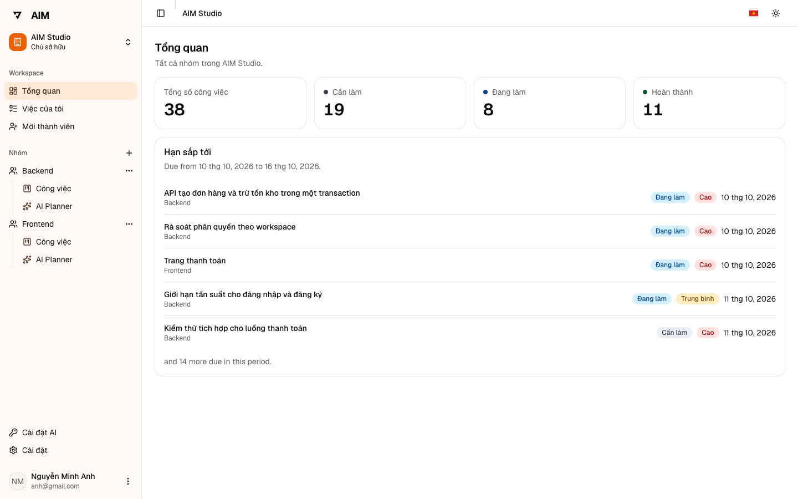
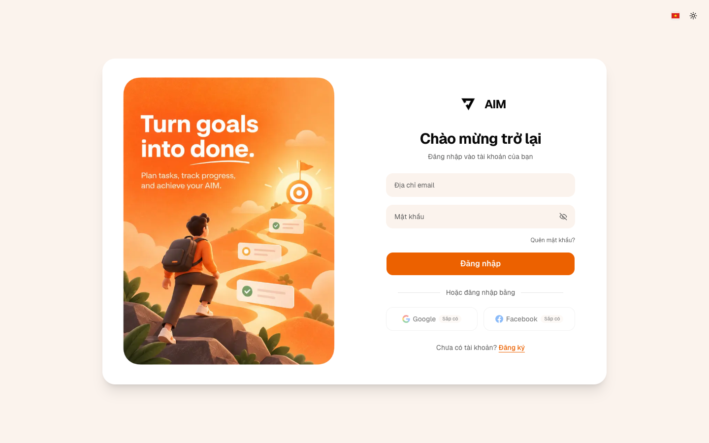
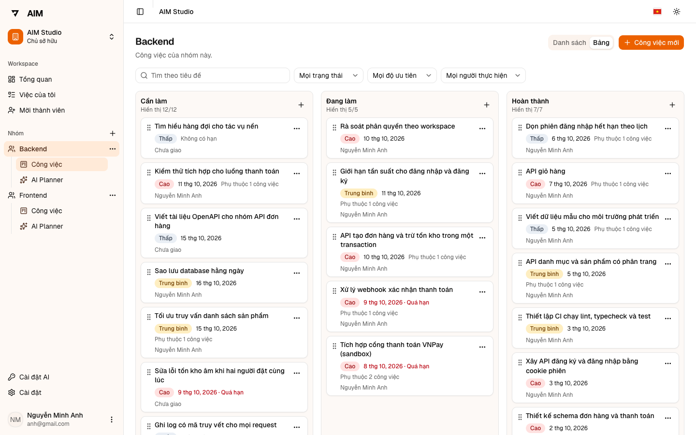
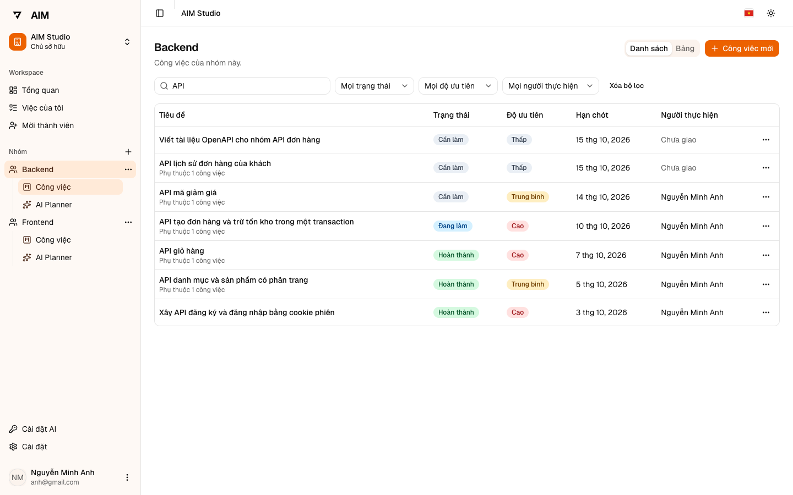
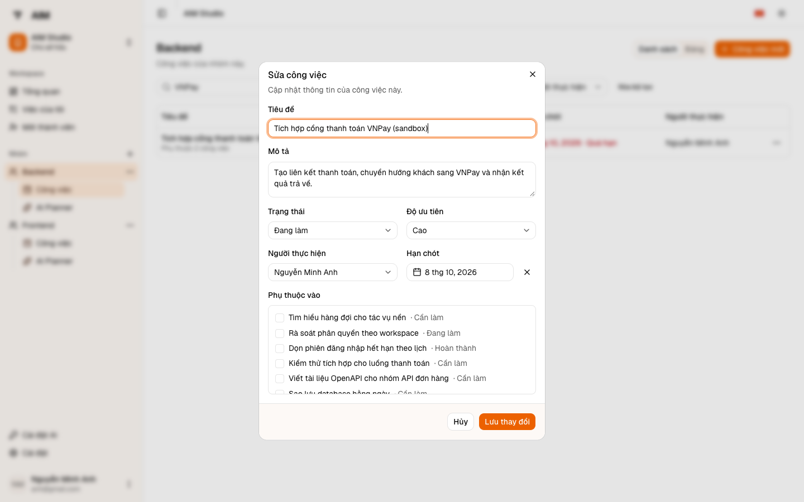
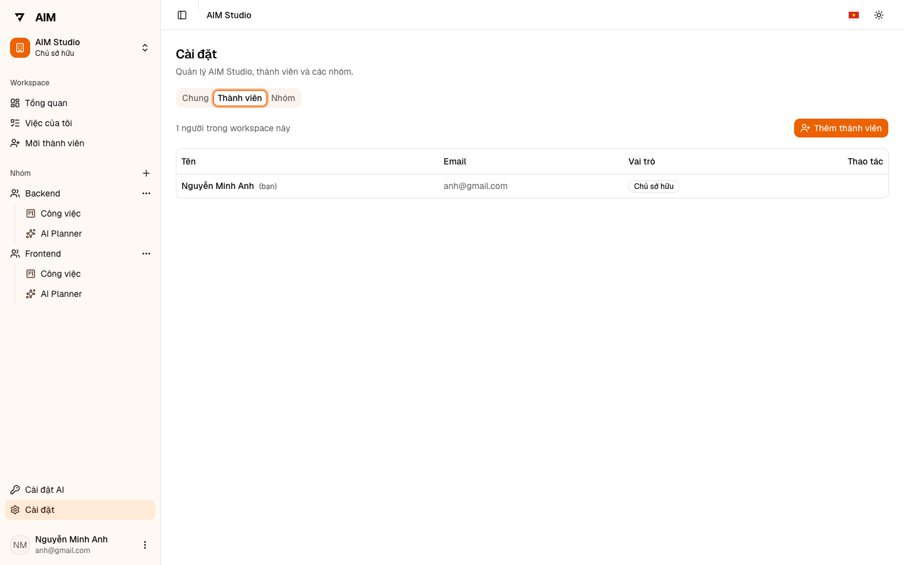
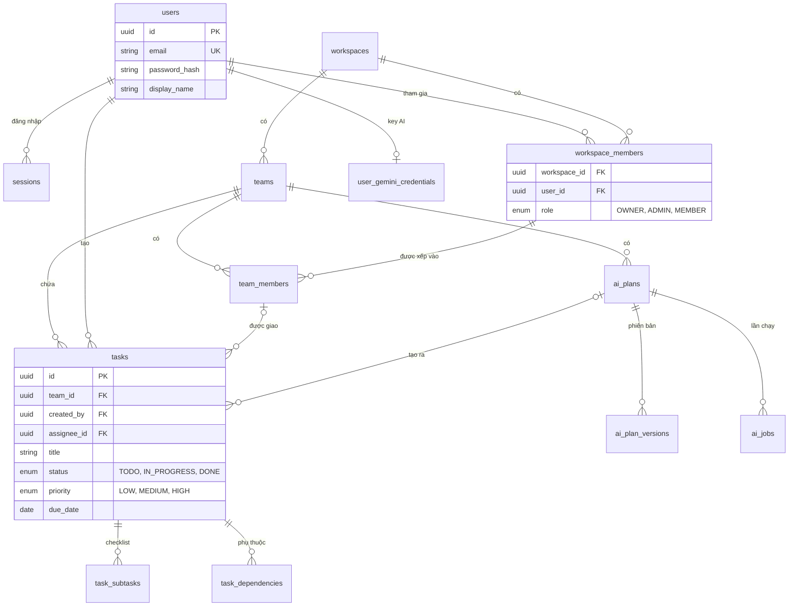

# AIM — Task Management System

Ứng dụng quản lý công việc cho cá nhân và nhóm nhỏ: đăng ký/đăng nhập, tạo workspace và team, quản lý task ở dạng danh sách hoặc Kanban kéo thả, tìm kiếm và lọc, theo dõi dashboard. Có thêm cập nhật tức thời và AI Planner biến một mục tiêu thành danh sách task.

Bài làm cho [đề bài tuyển dụng Intern](docs/01-requirements/assignment-brief.md), vị trí Fullstack.

| Thành phần | Công nghệ |
| --- | --- |
| Backend | Node.js 24, Express, TypeScript strict, Prisma, PostgreSQL 17, Zod, Swagger UI |
| Frontend | Next.js 16 (App Router), React 19, TypeScript strict, Tailwind CSS 4, shadcn/ui, TanStack Query, dnd-kit |
| Hạ tầng | Docker Compose, GitHub Actions, Docker Hub, Dokploy, Cloudflare Tunnel, Vitest |

**Bản demo:** https://task.darrenak.id.vn · **Swagger:** https://task-api.darrenak.id.vn/api/docs

## Mục lục

- [1. Thử nhanh trên bản demo](#1-thử-nhanh-trên-bản-demo)
- [2. Chạy bằng Docker](#2-chạy-bằng-docker)
- [3. Tài khoản](#3-tài-khoản)
- [4. Chức năng đã hoàn thành](#4-chức-năng-đã-hoàn-thành)
- [5. Hình ảnh minh hoạ](#5-hình-ảnh-minh-hoạ)
- [6. Phân quyền](#6-phân-quyền)
- [7. Sơ đồ database](#7-sơ-đồ-database)
- [8. Test và CI](#8-test-và-ci)
- [9. Chưa làm và hạn chế](#9-chưa-làm-và-hạn-chế)
- [10. Video demo](#10-video-demo)



## 1. Thử nhanh trên bản demo

Mở https://task.darrenak.id.vn và đăng nhập bằng `anh@gmail.com` / `12345@Abc`. Workspace **AIM Studio** có sẵn 38 task trong hai team Backend và Frontend.

| Thử | Làm gì | Kết quả |
| --- | --- | --- |
| Dashboard | Mở **Tổng quan** | Tổng 38 task: 19 cần làm, 8 đang làm, 11 hoàn thành; danh sách hạn sắp tới |
| Phân trang | Mở team Backend → **Công việc** | 24 task, chia 2 trang |
| Tìm kiếm | Gõ `API` | 7 task |
| Lọc | Trạng thái Đang làm + ưu tiên Cao | 4 task |
| CRUD | Tạo một task, sửa, rồi xoá | Danh sách đổi ngay, không tải lại trang |
| Kanban | Chuyển sang **Bảng**, kéo một thẻ sang cột khác | Thẻ đổi trạng thái; số trên dashboard đổi theo |
| Cách ly dữ liệu | Đăng nhập `khanh@gmail.com` | Chỉ thấy workspace Quán Cà Phê Sáng |

Các con số đúng với dữ liệu gốc và sẽ đổi khi có người thêm, sửa, xoá task. Giao diện có tiếng Việt và tiếng Anh (nút cờ ở góc trên), light và dark mode.

## 2. Chạy bằng Docker

Cần Docker, Node.js 24.21.0 và npm 11.

```bash
cp .env.example .env        # đổi mật khẩu PostgreSQL mẫu; giữ APP_ORIGIN=http://localhost:3000
npm ci
npm run docker:dev:up       # PostgreSQL + migration + API tại http://127.0.0.1:4000
npm run dev:web             # web tại http://localhost:3000
```

- Web: http://localhost:3000 (đăng ký / đăng nhập tại đây)
- API: http://127.0.0.1:4000/api — Swagger: http://127.0.0.1:4000/api/docs
- Migration tự chạy trước khi API khởi động.
- Dừng stack, giữ dữ liệu: `npm run docker:dev:down`

Dữ liệu mẫu: đặt `SEED_DEMO_DATA=yes` và `SEED_DEMO_PASSWORD` (từ 8 ký tự) trong `.env`, rồi chạy:

```bash
npm run docker:dev:seed
```

Seed tạo 2 tài khoản, 2 workspace, 3 team và 44 task tiếng Việt; chạy lại không tạo trùng.

Bản production chạy cả bốn dịch vụ (database, migration, API, web) bằng [docker-compose.prod.yml](docker-compose.prod.yml). AI Planner ở local cần thêm keyring mã hoá và giới hạn token trong `.env`, xem [runbook](docs/03-operations/backend-operations-runbook.md).

## 3. Tài khoản

| Loại | Email | Mật khẩu | Workspace |
| --- | --- | --- | --- |
| Demo (seed) | `anh@gmail.com` | `12345@Abc` trên bản demo; local theo `SEED_DEMO_PASSWORD` | AIM Studio (team Backend, Frontend) |
| Demo (seed) | `khanh@gmail.com` | như trên | Quán Cà Phê Sáng (team Vận hành) |
| Tự đăng ký | trang **Đăng ký** (`/register`) | tự đặt, 8–128 ký tự | chưa có, tự tạo |

Hai tài khoản demo thuộc hai workspace tách biệt, dùng để kiểm tra việc cách ly dữ liệu.

## 4. Chức năng đã hoàn thành

Cột "Đề bài": A là bắt buộc, B là cộng điểm, "Thêm" là phần làm ngoài đề bài.

| # | Chức năng | Chi tiết | Đề bài |
| --- | --- | --- | --- |
| 1 | Đăng ký | Email, mật khẩu 8–128 ký tự; chống trùng email | A.1 |
| 2 | Đăng nhập / đăng xuất | Phiên lưu phía server, cookie `HttpOnly` + `SameSite=Lax` + `Secure`; đăng xuất thu hồi phiên | A.1 |
| 3 | Mã hoá mật khẩu | Argon2id; response và log không chứa hash | A.1 |
| 4 | Cách ly dữ liệu | Người ngoài workspace nhận 404 cho mọi tài nguyên, kể cả khi biết đúng ID | A.1 |
| 5 | Task CRUD | Tiêu đề, mô tả, trạng thái (`TODO`, `IN_PROGRESS`, `DONE`), ưu tiên (`LOW`, `MEDIUM`, `HIGH`), hạn hoàn thành | A.2 |
| 6 | Tìm kiếm | Theo tiêu đề, khớp một phần, không phân biệt hoa thường | A.3 |
| 7 | Lọc | Theo trạng thái, ưu tiên, người thực hiện; kết hợp được với tìm kiếm; điều kiện nằm trên URL | A.3 |
| 8 | Phân trang | 20 task mỗi trang; mỗi cột Kanban tải thêm 20 task mỗi lần | A.3 |
| 9 | Dashboard | Tổng số task, số task theo ba trạng thái, danh sách sắp đến hạn trong 7 ngày | A.4 |
| 10 | Kanban | Kéo thả bằng chuột, cảm ứng, bàn phím; chuyển ngay và tự hoàn lại nếu server từ chối | B |
| 11 | Docker Compose | Stack dev (database, migration, API) và stack production (thêm web) | B |
| 12 | Test | 133 test API (phần lớn trên PostgreSQL thật), 113 unit test web | B |
| 13 | Swagger / OpenAPI | 49 operation tại `/api/docs`; kiểu dữ liệu phía web sinh từ OpenAPI | B |
| 14 | CI | GitHub Actions chạy audit, lint, typecheck, test, build trên mỗi PR và push | B |
| 15 | Deploy demo | CI xanh trên `main` thì đẩy image lên Docker Hub; deploy bằng Dokploy | B |
| 16 | Workspace, team, vai trò | Owner / Manager / Member theo từng workspace; thêm thành viên theo email | Thêm |
| 17 | Task mở rộng | Người thực hiện, ngày bắt đầu, ước lượng, tiêu chí hoàn thành, checklist, phụ thuộc giữa task (không cho vòng lặp) | Thêm |
| 18 | Việc của tôi | Các task được giao cho mình trong workspace | Thêm |
| 19 | Cập nhật tức thời | Thay đổi của người khác tự hiện qua Server-Sent Events, không polling | Thêm |
| 20 | AI Planner | Nhập mục tiêu → AI hỏi lại nếu thiếu thông tin → bản nháp task → sửa và xác nhận mới tạo task. Mỗi người dùng Gemini key riêng, mã hoá phía server | Thêm |
| 21 | Hai ngôn ngữ, dark mode | Tiếng Việt và tiếng Anh | Thêm |
| 22 | Seed demo | 2 tài khoản, 2 workspace, 3 team, 44 task có checklist và phụ thuộc | Bàn giao |

## 5. Hình ảnh minh hoạ

### Đăng nhập



### Kanban kéo thả

Ba cột theo trạng thái, mỗi cột ghi số task đang hiển thị trên tổng số. Thẻ quá hạn được đánh dấu đỏ.



### Danh sách, tìm kiếm và lọc

Tìm `API` trong team Backend trả về 7 task.



### Sửa task

Một task có trạng thái, ưu tiên, người thực hiện, hạn chót và các task phải xong trước.



### Thành viên



## 6. Phân quyền

Vai trò gắn với từng workspace; không có tài khoản quản trị toàn hệ thống.

| Việc | Owner | Manager | Member |
| --- | --- | --- | --- |
| Xem, tạo, sửa task trong team mình thuộc | Có | Có | Có |
| Xem, tạo, sửa task của mọi team | Có | Có | Không |
| Xoá task | Mọi task | Mọi task | Chỉ task mình tạo |
| Đổi tên workspace; tạo, đổi tên team | Có | Có | Không |
| Xem và thêm thành viên, xếp người vào team | Có | Có | Không |
| Xoá thành viên | Manager và Member | Chỉ Member | Không |
| Đổi vai trò người khác | Có | Không | Không |

"Manager" là tên hiển thị; giá trị trong API và database là `ADMIN`. Giao diện ẩn hoặc hiện nút theo bảng này, còn API kiểm tra lại quyền ở mọi request.

## 7. Sơ đồ database

Các bảng chính. 10 migration Prisma tạo bảng, khoá ngoại và ràng buộc; ví dụ người thực hiện phải thuộc team của task.



Toàn bộ schema: [apps/api/prisma/schema.prisma](apps/api/prisma/schema.prisma).

## 8. Test và CI

```bash
npm run lint        # ESLint cho cả hai app
npm run typecheck   # TypeScript cho cả hai app
npm test            # test API rồi test web
```

Test API cần một PostgreSQL riêng cho test, xem [apps/api/README.md](apps/api/README.md).

Quy trình phát hành: nhánh tính năng → PR vào `dev` → PR vào `main` → `Backend CI` và `Web CI` → image lên Docker Hub → deploy trên Dokploy. Chi tiết vận hành, rollback, backup: [runbook](docs/03-operations/backend-operations-runbook.md).

## 9. Chưa làm và hạn chế

Chưa làm:

- Đăng nhập bằng Google / Facebook và quên mật khẩu: có hiển thị nhưng bị khoá.
- AI Planner: chưa cho AI làm lại riêng một task (chỉ làm lại cả kế hoạch); chưa so sánh hai phiên bản kế hoạch.
- Stack Docker dev chưa gồm web; web chạy bằng `npm run dev:web`.

Hạn chế đã biết:

- Tìm kiếm phân biệt dấu tiếng Việt: `thanh toan` không tìm ra `thanh toán`.
- Một số thông báo sinh từ server vẫn bằng tiếng Anh khi giao diện là tiếng Việt.
- Danh sách sắp đến hạn không tự làm mới khi sang ngày mới.

Tài liệu thiết kế: [PRD](docs/01-requirements/task-management-system-prd.md), [kiến trúc](docs/02-architecture/system-architecture.md), [AI + realtime](docs/02-architecture/ai-and-realtime-technical-design.md), [đối chiếu yêu cầu với code và test](docs/01-requirements/prd-traceability.md).

## 10. Video demo

Sẽ bổ sung.
