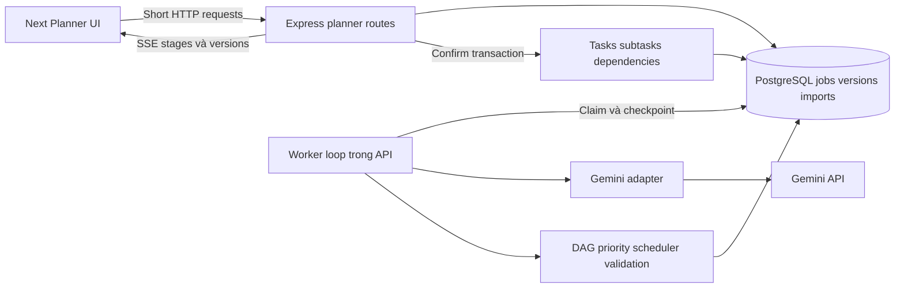
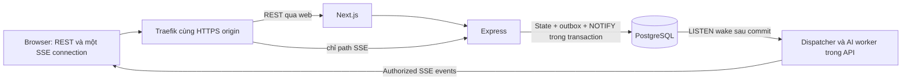

# Task Management System — AI Planner và Realtime Technical Design

## 1. Phạm vi và quyết định

- Nguồn phân hệ: [AI Planner PRD](../01-requirements/ai-smart-task-planner-prd.md), bản sao nguyên văn. Scope toàn hệ thống theo [Task Management System PRD](../01-requirements/task-management-system-prd.md); áp dụng cùng [System Architecture](system-architecture.md).
- Chủ repo xác nhận **toàn bộ MVP và toàn bộ phần nâng cao**, **chỉ một loại provider/key: mỗi tài khoản tự nhập đúng một Gemini API key và model muốn dùng**, **subtask là checklist trong task**. Không có shared Gemini key, provider key khác hoặc key người dùng dùng chung giữa tài khoản. Các phần nâng cao là yêu cầu phải hoàn thành, không phải backlog tùy chọn.
- Đây là thiết kế trước code; chưa có bằng chứng implementation, AI request, tests hoặc deployment hoạt động.
- Project trong spec ánh xạ thành **team được chọn trong workspace**. Không thêm entity Project. Mỗi plan có một team đích, không import xuyên team/workspace.
- Giữ Express/Next.js/PostgreSQL/Prisma, shadcn/ui/React Bits/Tailwind và GitHub Actions → Docker Hub → Dokploy → VPS. Worker loop chạy trong API process; không thêm dịch vụ queue hoặc Node process/image mới.
- Flow: **Goal → Draft Plan → Review/Edit → Confirm → Real Tasks**. Ghi job/draft/history vào DB để phục hồi được; chỉ confirm mới ghi tasks/subtasks/dependencies thật.
- Quyết định chi tiết: draft riêng người tạo; import nguyên tử; một plan chỉ import một lần; điều chỉnh deadline tạo đề xuất/version, không tự sửa task đã import.
- Mỗi tài khoản cấu hình Gemini key riêng. AI job chỉ dùng credential của creator; không chia sẻ theo workspace hoặc role. Key gắn với Google Cloud project; quota áp theo project và billing theo Cloud Billing account liên kết. Người dùng cần dùng project họ được phép sử dụng và chịu trách nhiệm với billing account đó. Model khả dụng và quỹ giờ cần kiểm tra khi setup; không cam kết đủ toàn bộ trong hai ngày.

### Yêu cầu nâng cao bắt buộc

| ID | Chức năng | Thiết kế/tiêu chí |
| --- | --- | --- |
| AI-A1 | Timeline năm bước thực | Hai Gemini calls và ba processors; events được commit theo công việc đã chạy |
| AI-A2 | Overload/deadline conflict | DAG/scheduler + capacity người dùng khai báo; cảnh báo uncertainty khi thiếu dữ liệu |
| AI-A3 | Phân công thành viên thật | Roster được chọn, role/capacity có nguồn; assignee được user duyệt và revalidate khi import |
| AI-A4 | Dependencies và thứ tự | Draft graph + persisted task graph; kiểm tra missing edges, cycle và timeline |
| AI-A5 | Regenerate từng phần/simplify/detail | Jobs trên base version, field masks và manual locks; review trước nhận proposal |
| AI-A6 | Fastest/Balanced/Quality-first | Quy tắc rõ ở mục 6, cùng hard constraints |
| AI-A7 | Context task hiện có | Opt-in, snapshot scoped/bounded, duplicate suggestions và conflict warnings |
| AI-A8 | History và version comparison | Immutable versions, stable item IDs, diff theo field; không ghi đè edits |
| AI-A9 | Điều chỉnh khi đổi deadline | User yêu cầu ADJUST_DEADLINE tạo candidate version; recheck constraints và giữ locked fields |

## 2. Phương án kiến trúc

| Phương án | Ưu điểm | Chi phí/giới hạn | Quyết định |
| --- | --- | --- | --- |
| HTTP đồng bộ, một Gemini call | Ít runtime logic | Không chứng minh năm semantic stages; timeout/restart khó recovery | Không chọn cho full scope |
| **PostgreSQL jobs + event-driven worker + SSE** | Reuse DB/image, có state/history/cancel/resume; HTTP ngắn | Cần lease/fencing, outbox/replay, scheduler và shutdown rõ | **Chọn**, concurrency AI khởi đầu 1 |
| Worker container riêng, cùng API image | Drain/scale/tài nguyên độc lập | Thêm runtime/deploy và pool headroom | Hướng tách khi đo thấy API bị ảnh hưởng; không cần cho bản thiết kế hiện tại |

### Ranh giới BE

| Thành phần | Trách nhiệm |
| --- | --- |
| planner routes/controllers | Session/origin/schema validation, status/envelopes, request IDs |
| planner policy | Creator và quyền team hiện tại; không dùng history làm quyền truy cập |
| plan service | Versions, compare inputs, candidate activation, confirm/idempotency |
| job repository/runner | Durable jobs/events, quota reservation, lease/heartbeat/fencing |
| gemini adapter | Schema-bound request/result, model/config, timeout, usage; không ghi task |
| priority/schedule validators | DAG, capacity, relative/absolute dates, strategy và warnings |
| task service | CRUD cả task thủ công và AI, checklist/dependency rules, locks/FKs |

Đặt code trong apps/api/src/modules/planner và apps/web/src/features/planner. Runner khởi tạo từ server.ts sau DB/migrations ready; không chạy trong app factory dùng cho Supertest. LLM HTTP ngoài transaction, không giữ connection/row locks suốt generation. Processor hữu hạn không chạy vòng CPU dài trong event loop.

## 3. Quyền và dữ liệu đưa cho AI

1. OWNER/ADMIN lập plan cho team trong workspace của mình; MEMBER phải thuộc team. Quyền tạo task giống system design. Draft/jobs/history chỉ creator đọc/sửa/confirm, kể cả admin không mặc định xem goal riêng của người khác.
2. Kiểm tra scope URL/session/creator cho mọi endpoint; IDs ngoài quyền trả 404. Assignee luôn phải là thành viên team, admin cũng phải tham gia để được giao việc.
3. Gemini key là credential của user, không thuộc workspace: OWNER/ADMIN không được xem hoặc dùng key thành viên khác. Mỗi worker lookup key theo `ai_jobs.creator_id`; key không có trong plan, prompt/context, job input/output, checkpoint, outbox, SSE, trace, response hoặc log.
4. Worker kiểm tra quyền trước lấy context, trước mỗi provider call và trước lưu version. Recheck dưới membership locks ở transaction ngắn; không giữ lock trong lúc gọi Gemini. Revoke sau request đã bắt đầu không thể thu hồi dữ liệu đã gửi ra provider.
5. Worker lấy credential hiện hành ngay trước từng provider call và kiểm tra `credential_revision`; nếu credential bị xóa/thay trước attempt thì dừng, không gửi. Request đã bắt đầu có outcome không chắc chắn thì theo semantics hiện có, không retry mù; không thể thu hồi request đã gửi hoặc phí phát sinh.
6. Sau revoke, không expose plan/result hoặc cho confirm. Worker dừng phần chưa gửi và discard output muộn; việc join lại không tự resume job đã bị dừng, user phải yêu cầu lại.
7. Default context chỉ goal/options/constraints. Hai opt-ins riêng: **task hiện có** và **thành viên/role/capacity**; UI preview nội dung dự định gửi trước Generate.
8. Context chỉ team đích, user chọn IDs thật; dùng opaque aliases cho members, không gửi email/password/session/keys. Snapshot ghi IDs, updatedAt, dữ liệu đã chọn và thời điểm; provider không tự query DB.
9. User có thể khai báo số người/roles chung khi không gửi roster. Không bịa tên hoặc năng lực; suggestedRole được giữ, suggestedAssigneeId phải null khi không đủ căn cứ.
10. Role/capacity là **bối cảnh do người dùng xác nhận**, không suy ra từ role OWNER/ADMIN/MEMBER. Capacity có thể khai báo phút/ngày và ngày làm việc; thiếu capacity phải ghi unknown.
11. Input/task descriptions là dữ liệu untrusted; system instruction và schema không cho truy cập tool, URL, DB hoặc hành động ngoài planner. Không bật model tools/function execution/grounding để tạo task.
12. Consent disclosure nói rõ nội dung đã chọn được gửi tới Gemini và dùng key đã cấu hình; quota áp theo Google Cloud project và billing vào Cloud Billing account liên kết với project. Người dùng phải xác nhận có quyền sử dụng project/key đó. Chính sách xử lý dữ liệu phụ thuộc service/tier thực tế; không hứa dữ liệu không được lưu/dùng nếu chưa đối chiếu tier. Demo dùng dữ liệu giả. [Gemini terms](https://ai.google.dev/gemini-api/terms), [billing](https://ai.google.dev/gemini-api/docs/billing/).

## 4. Job lifecycle và tiến trình trung thực

### Năm stage thật

| Stage/UI | Công việc thực | Khi được completed |
| --- | --- | --- |
| Understanding your goal | Gemini phân tích scope, hard constraints, assumptions và tối đa 3 câu hỏi | Output validated và clarification đã được giải quyết/chấp nhận giả định hợp lệ |
| Breaking down the work | Gemini tạo/điều chỉnh structured draft: tasks, criteria, subtasks, estimates, priorities, edges, role hints | Output hoàn chỉnh vượt schema/limits; chưa là task thật |
| Prioritizing tasks | Local validate priority/rationale, DAG và rank theo strategy | Processor trả kết quả hoặc warnings có nguồn; không giả là suy nghĩ của Gemini |
| Planning the timeline | Local schedule/validate dates, dependency order, capacity và deadline conflicts | Kiểm tra thật đã xong; missing inputs thể hiện unknown/skipped phù hợp |
| Preparing your plan | Cross-field/duplicate/lock validation, persist immutable candidate version | Version, completed event và realtime outbox cùng transaction đã commit |

Mỗi stage có pending/active/completed/failed/skipped, timestamps, sequence và safe summary. UI dùng events DB, không tick bằng timer hoặc hiển thị phần trăm giả. Summary chỉ số task/warnings kiểm chứng được; không nhận/hiển thị chain-of-thought. Gemini token streaming không thay thế semantic stages.

### Trạng thái và recovery

- Job: QUEUED → RUNNING → NEEDS_CLARIFICATION / SUCCEEDED / FAILED / CANCELLED / INTERRUPTED. Plan: DRAFT / IMPORTED / EXPIRED; candidate version có thể chưa active.
- NEEDS_CLARIFICATION giữ tối đa 3 questions và input; user trả lời hoặc Continue with assumptions. Không cho lựa chọn này bỏ qua goal rỗng, constraints mâu thuẫn không thể xử lý hoặc validation bắt buộc. Một vòng làm rõ/job; nếu vẫn thiếu thì yêu cầu sửa input.
- POST tạo job trả 202 với planId/jobId; một SSE connection/tab đẩy stages/state/version qua [realtime contract](ai-and-realtime-technical-design.md#156-sse-endpoint-bootstrap-và-reconnect). GET snapshot initial/recovery hoặc khi event yêu cầu; **không polling/fallback**. Reload dùng URL/job ID hoặc requestKey, không tự tạo job mới.
- Claim trong transaction ngắn bằng row lock/SKIP LOCKED, ghi lease token/attempt/expiry rồi commit. Đây là queue claim, không dùng SKIP LOCKED cho list tasks. [PostgreSQL SELECT](https://www.postgresql.org/docs/current/sql-select.html).
- Concurrency worker 1/instance, heartbeat khởi đầu 10s, lease 30s; kết quả/checkpoint phải CAS token+attempt+RUNNING+lease chưa hết. Token hết hạn/cancelled không được ghi version hoặc hồi sinh job.
- Persist checkpoint và stage events/outbox nguyên tử; cấp cursor cuối transaction theo [commit-safe order](ai-and-realtime-technical-design.md#154-hai-bảng-và-commit-safe-cursors). Không auto restart paid call: lease mất/restart giữa provider request → INTERRUPTED, giữ input/checkpoints và báo kết quả/chi phí có thể chưa rõ; Retry là hành động có chủ ý. Stage chưa gửi request có thể claim lại.
- Ghi marker provider request bắt đầu **trước** gửi HTTP. Worker chết sau marker mà chưa lưu result vẫn coi outcome unknown; không khẳng định model xử lý exactly once.
- Cancel queued chắc chắn không gửi; running đổi state/lease, best-effort abort local HTTP và bỏ output muộn. Không hứa Gemini đã ngừng xử lý/tính phí. Đóng UI chỉ bỏ subscription plan, không ngầm hủy job; Close cảnh báo draft chưa được import.
- Plan generated khác Tasks created. Timeout không hiện Done; đang RUNNING hợp lệ có “Still preparing…”; quá job deadline thành FAILED/INTERRUPTED với Retry/Edit.

## 5. Versioning, chỉnh sửa và chống ghi đè

- Mỗi version là snapshot immutable có UUID, ordinal, parent/baseVersionId, source GENERATED/EDITED/REGENERATED/ADJUSTED, schemaVersion, input/context snapshot, item UUIDs, field locks và draft JSON.
- Item IDs ổn định qua edits và targeted AI updates; task/subtask mới có ID mới. Dependencies dùng IDs, không dùng index/thứ tự UI. AI không được tự đổi ID item đã tồn tại.
- Manual edits tạo version mới với expectedActiveVersionId, CAS trên plan row; mismatch trả 409 VERSION_CONFLICT cùng version hiện tại. Locked fields ghi explicit; selection/order cũng được giữ khi không nằm trong requested field mask.
- Generate lần đầu có thể activate version đầu khi plan chưa có active version. Những lần AI regenerate/adjust sau tạo **candidate**, không thay active draft hoặc edits đang gõ.
- User nhận candidate bằng expectedActiveVersionId; BE kiểm tra **candidate.baseVersionId = expectedActiveVersionId = active version hiện tại**, không chỉ CAS request với current. Active đã đổi → 409, giữ proposal để diff; user merge thủ công thành version mới trên current base, không bypass bằng ID mới gửi từ client.
- Regenerate this task chỉ cho item/fields được chọn; Make simpler/detailed giới hạn cùng hard constraints; ADJUST_DEADLINE chỉ đề xuất thay schedule/estimates/scope được phép, không xóa yêu cầu “không thể bỏ qua”.
- Manual locks thắng model patch. Muốn override phải chọn rõ fields và confirm cảnh báo; override nằm trong request, không từ nội dung model. Full regenerate cũng cần cảnh báo edits và preserve locks mặc định.
- History có metadata phân trang, xem revision và diff theo item/field: added/removed/changed, schedule/priority/subtask/dependency/assignee changes. Không chỉ so đoạn text AI.
- Plan đã IMPORTED chỉ đọc history; adjust/regen dùng **clone draft có chủ ý**, không cập nhật task thật. Task thật vẫn sửa bằng CRUD thường. Clone không tự import hoặc mặc định chọn lại mọi task cũ để tạo duplicates.

## 6. Schedule, estimate, dependency và strategies

### Dữ liệu và quy tắc ngày

- Priority enum HIGH/MEDIUM/LOW giữ contract hiện tại; priorityReason và completionCriteria lưu cùng task. Criteria phải có đầu ra kiểm chứng được; AI không tự cho tất cả HIGH mà không lý do.
- Estimate là khoảng min/max phút hoặc null; units chuẩn hóa phía BE. Có estimate thì 1 ≤ min ≤ max ≤ 525600; UI ghi “ước lượng”, không coi là tracked time.
- Schedule draft discriminated union NONE / RELATIVE / ABSOLUTE. RELATIVE dùng Day N, N ≥ 1; ABSOLUTE dùng DATE YYYY-MM-DD. Không cho end < start hoặc trộn hai mode.
- “14 ngày” không có startDate → giữ relative days, không lấy today âm thầm. User xác nhận anchor mới đổi Day N thành anchor + N−1 ngày; chuyển theo lịch/date-only, không cộng milliseconds UTC làm lệch ngày.
- TargetDate không tự tạo StartDate. Không đủ anchor/capacity thì warnings và relative/unknown schedule; dates/assignees không được bịa để làm form trông đầy đủ.
- Sau import, RELATIVE chưa có anchor giữ dueDate null và offsets trong metadata; ABSOLUTE ghi plannedStart/dueDate. Dashboard chỉ đếm deadline tuyệt đối như thiết kế lõi, không tính Day N thành ngày thật.
- Sửa deadline thật bằng CRUD phải giữ start ≤ due; chuyển sang absolute bỏ offsets tương đối gây mâu thuẫn. Calendar picker/clear xử lý date-only và không tự chặn overdue hợp lệ.

### DAG và workload

- Draft DAG gồm selected draft item IDs và existing task IDs user đã duyệt khi opt-in context. Chặn IDs không có, self-edge, cycle, dependency tới item bỏ chọn; cho sửa edge hoặc chọn lại predecessor.
- UI order khác dependency order; scheduler dùng topological order. Với lịch ở mức ngày, finish-to-start mặc định dependent bắt đầu ngày sau predecessor hoàn thành; manual same-day cần sửa quan hệ/schedule thay vì giả định giờ.
- Dùng estimate upper bound để tính conservative load; không cộng parent estimate và subtask estimates hai lần. Checklist không có workload/assignee/deadline riêng.
- Role hints chỉ là suggestion. Actual member assignment cần role/capacity có nguồn và roster thật; user duyệt trước import. Người không có dữ liệu capacity không được đánh dấu chắc chắn “quá tải”.
- Capacity đã khai báo: ngày làm việc và minutes/day, tối đa 1440/day; planner lấy existing non-DONE assigned tasks trong context đã chọn. Chưa anchor/start hoặc task thiếu estimate → phần tải đó unknown, hiển thị phạm vi phân tích.
- Kiểm tra dependency order, overload theo member/ngày, target infeasible và thiếu capacity/estimate. Không sửa/defer task hiện có hoặc bỏ hard requirement để che conflict. Duplicate titles/goals chỉ warning gộp/bỏ chọn, không auto xóa task thật.
- Context bị cap hoặc snapshot đã cũ → chỉ claim cảnh báo trên dữ liệu đã thấy; confirm recheck referenced IDs/membership/updatedAt. Stale context trả 409 CONTEXT_CHANGED để review version cập nhật, không tự ghi lịch khác với bản user đã duyệt.

| Strategy | Quy tắc |
| --- | --- |
| FASTEST | Topological priority, cho song song các tasks độc lập khi capacity thực cho phép; không invent thêm người hoặc cắt hard scope |
| BALANCED | Greedy phân bổ trên ngày/người được xác nhận, ưu tiên giảm peak load và giữ deadline; thiếu capacity thì thứ tự + warning, không kết luận cân bằng tối ưu |
| QUALITY_FIRST | Gemini breakdown có review/testing/acceptance theo goal, scheduler giữ các bước đó và buffer được khai báo; trade-off thời gian/scope được trình bày |

Đây là heuristics có thể giải thích, không là optimizer chứng minh lịch tốt nhất hoặc dự đoán năng suất. AI có thể đề xuất giảm scope/đổi deadline, user quyết định. Timeline điều chỉnh là bản nháp mới, không tự reschedule task thật.

## 7. Persistence và invariants

Giữ **7 bảng lõi**, thêm một bảng credential và **7 bảng** AI/checklist/dependency dưới đây; sửa tasks bằng migration additive. Cộng [2 bảng realtime](ai-and-realtime-technical-design.md#154-hai-bảng-và-commit-safe-cursors), tổng hệ thống **17 bảng**, không có Project entity.

| Bảng/thay đổi | Dữ liệu chính |
| --- | --- |
| user_gemini_credentials | user_id PK/FK, provider=GEMINI, ciphertext, nonce, authentication_tag, encryption_key_version, credential_revision, model, verified_at, created_at/updated_at; một Gemini key/model mỗi user |
| ai_plans | id, workspace/team/creator, state, active_version_id, imported_at, created_at, expires_at |
| ai_plan_versions | id, plan_id, ordinal, base/parent_version_id, source, schema_version, draft/input/context JSONB, locks JSONB, content_hash, created_at |
| ai_jobs | id, plan_id, creator/scope, `credential_revision`, action/base_version, request_key/hash, input JSONB, status/events/checkpoints, lease token/expiry/attempt, provider/model/usage/error, started/finished_at |
| ai_imports | plan_id UNIQUE/PK, confirmed_version_id, request_key, payload_hash, item→task mapping/response JSONB, committed_at |
| ai_usage_daily | scope_type USER/WORKSPACE/GLOBAL, scope_id, date, reserved/started calls và token budget, updated_at; compound PK |
| task_subtasks | id, task_id, position, title, is_completed, timestamps; checklist editable |
| task_dependencies | workspace/team, task_id, prerequisite_id; compound PK task_id/prerequisite_id |
| tasks mở rộng | completion_criteria, priority_reason, estimate_min/max_minutes, planned_start_date, relative_start/due_day, source_plan/item IDs nullable |

### Constraints và locks

- UUID entities; versions UNIQUE(plan_id, ordinal), UNIQUE(plan_id,id). Plan active_version dùng composite FK để không trỏ version plan khác; insert plan với active_version null rồi tạo/activate version atomically.
- Jobs FKs scope/plan, UNIQUE(creator_id,workspace_id,team_id,request_key) và input hash; cùng key/body trả job cũ, key/body khác 409 IDEMPOTENCY_CONFLICT. Lookup luôn check creator + quyền hiện tại.
- Import receipt UNIQUE(plan_id) giữ mapping qua task deletion; không FK mapping JSON tới tasks để replay không hồi sinh task đã xóa. Unique task source(plan_id,item_id) chặn duplicate mapping khi còn task; receipt là chốt chống reimport lâu dài.
- Draft/job data có workspace/team FK và creator user FK, không FK creator membership làm mất history khi revoke. Scope immutable; đổi team tạo plan mới có chủ ý, không âm thầm đem context cũ gửi sang team khác.
- Credential owner là `user_id`; FK tới users ON DELETE CASCADE, UNIQUE/PK đảm bảo một Gemini API key mỗi user và không có provider/key loại khác. User nhập key cùng model muốn dùng; `model` được lưu với credential và chụp vào `ai_jobs.model` lúc tạo job. Node built-in `crypto` AES-256-GCM encryption-at-rest, 32-byte key, random 12-byte nonce và 16-byte tag; `user_id || provider` là AAD. Versioned server-side encryption keyring CREDENTIAL_ENCRYPTION_KEYRING và CREDENTIAL_ENCRYPTION_ACTIVE_KEY_VERSION chỉ ở API runtime secret; đây không phải Gemini API key và không hiển thị/nhập trên UI. Mỗi lần set/replace sinh revision UUID mới; job lưu revision dự kiến trong `ai_jobs.credential_revision`, nên delete rồi set lại cũng không hồi sinh job cũ (không có credential hiện hành hoặc revision không còn khớp). Khi rotate master key, chấp nhận key cũ/mới trong lúc re-encrypt; chỉ bỏ key cũ sau khi mọi row và backup cần hỗ trợ đã chuyển hoặc hết hạn.
- Keyring runtime và credential chỉ được mount vào API service với quyền đọc tối thiểu. Mã hóa DB không bảo vệ credential nếu API process và keyring đồng thời bị chiếm; cần giới hạn quyền Dokploy, HTTPS, patching và log redaction.
- Credential API chỉ cho authenticated owner; GET trả `configured`, `model`, `verifiedAt` và metadata revision, không trả ciphertext/nonce/tag/key. PUT nhận một Gemini API key và model; PATCH xác minh model mới bằng key đã lưu. Workspace role không cấp quyền đọc. DELETE xóa bản sao mã hóa trong app; user cần revoke/rotate ở Google AI Studio nếu key lộ.
- Ciphertext/AAD authentication failure hoặc thiếu encryption-key version phải fail closed, không gửi request Gemini. Raw key chỉ nằm tạm trong ô nhập người dùng và request HTTPS tới backend; backend không echo key và không lưu trong browser storage, request body logs, app logs, job/prompt/context, traces, events, image hoặc CI artifact.
- Job lưu revision lúc được nhận. Worker so revision hiện tại với `ai_jobs.credential_revision` ngay trước mỗi provider attempt và sau khi nhận kết quả; attempt chưa gửi sẽ dừng nếu credential đổi/xóa. Nếu credential đổi khi call đang chạy, kết quả/chi phí có thể chưa rõ: discard late output, đánh dấu outcome unknown theo lifecycle hiện tại và không gửi tiếp hoặc retry tự động.
- Subtasks FK task ON DELETE CASCADE, UNIQUE(task_id,position), title trim 1–200; tối đa 10/task và 100/plan khi confirm. Đây là checklist, không xuất hiện như task riêng trên Board/counts.
- Thêm UNIQUE tasks(workspace_id,team_id,id). Hai composite FKs task_dependencies(workspace_id,team_id,task_id/prerequisite_id) tham chiếu đúng unique key này; CHECK hai IDs khác nhau. task_id CASCADE khi xóa dependent, prerequisite_id RESTRICT khi còn dependent; index(workspace_id,team_id,prerequisite_id), không cascade xóa task khác.
- Criteria tối đa 2000 chars, priorityReason 1000; estimate cặp null/null hoặc valid range; relative offsets cặp phù hợp mode, DATE start≤due khi đủ hai đầu. Task thủ công defaults criteria/reason rỗng, estimate/schedule null, checklist/edges rỗng.
- JSONB cũng validate schema/version/size tại write/read; schema output AI không thay FK, ownership, DAG hoặc date checks.
- Mọi import và sửa graph/xóa task lấy membership locks theo system design → team row FOR UPDATE → plan/import/version cần thiết → task IDs ổn định. Mọi graph mutation trong team cùng team lock để tránh hai writes riêng lẻ tạo cycle.
- Trước lock actor/targets, xác định tập assignee và memberships cần khóa theo thứ tự chung; chỉ revalidate sau lock. Không giữ team graph lock khi gọi Gemini. Version/job mutations khóa memberships → plan → job; quota reservation locks theo scope_type/id/date ổn định, không giữ qua provider call.
- Xóa prerequisite còn dependent trả 409 TASK_HAS_DEPENDENTS; UI hiển thị task trong quyền, cho sửa/unlink edges bằng quyền edit rồi mới xóa. Xóa parent xóa checklist/edges outgoing, không xóa task dependent.
- Task API đọc/PATCH detail mở rộng trả/sửa criteria, estimate, schedule, checklist; dependencies qua endpoint riêng ở mục 9. Member vẫn sửa task teammate trong team, delete vẫn theo creator/admin như lõi.

## 8. Confirm nguyên tử và idempotency

1. UI save manual version trước confirm, gửi **exact versionId + selected item IDs + requestKey**. Canonical payload hash = versionId + sorted unique selection IDs, không gồm requestKey; không dùng “latest”. Chưa confirm không tạo tasks.
2. Preflight transaction ngắn khóa actor memberships → plan, check quyền creator/scope hiện tại rồi **receipt trước mọi pre-import validation/target locks**. Có receipt: same hash/version/selection trả 200, khác trả 409 PLAN_ALREADY_IMPORTED; không kiểm lại assignee/context/expiry/draft body để phủ nhận commit cũ. Quyền creator hiện tại vẫn bắt buộc.
3. Chưa receipt: kết thúc preflight và bắt đầu write transaction mới, không giữ plan lock rồi lấy target locks ngược thứ tự. Lấy actor/target membership locks sorted → team graph → plan/import → tasks; **recheck receipt trước validations** vì request khác có thể vừa commit. Target row thiếu chỉ được báo lỗi sau nhánh receipt, không trong bước lấy locks.
4. Chỉ khi chưa receipt mới check DRAFT/no expiry/exact active version/selection ≥1, selected closure/graph/dates/criteria/estimates, actual assignees và context snapshot. Lỗi trả item/field details và **createdCount=0** chỉ khi biết chưa có committed import; giữ draft để sửa.
5. Map draft IDs → fresh task UUIDs; insert TODO tasks/checklists/mapped edges. Existing task refs chỉ nối khi user duyệt, cùng team. Insert receipt/mapping/response và mark IMPORTED **trong cùng transaction**; không Gemini/external IO/thông báo trước commit.
6. Counts chỉ selected parent tasks, subtaskCount riêng; first success 201/replay 200. Different key không vượt one-import-per-plan; hash/version/selection khác trả conflict, không tạo bổ sung.
7. Timeout/mất response có thể đã commit: state “đang kiểm tra”, GET receipt hoặc Retry cùng payload/key, không tạo plan mới. Không dùng createdCount=0 cho outcome chưa rõ; DB xác nhận abort mới báo failure không partial success.
8. Two tabs/keys chỉ một receipt thắng; serialize plan row + UNIQUE. Abort không có tasks/checklists/edges dở dang; atomic import không có partial writes.
9. Replay sau assignee bị gỡ, context thay đổi, task bị xóa hoặc draft body hết retention vẫn trả receipt gốc nếu actor còn quyền. Không resurrect tasks hoặc tuyên bố IDs vẫn tồn tại; retained hash/mapping/version metadata đủ để replay không cần draft đã purge.

## 9. API contracts

Các endpoint planner/dependency nằm dưới /api/workspaces/:wid/teams/:tid, auth/origin/envelope/errors như lõi. Dưới đây dùng prefix ngắn; UUIDs cho pid/vid/jid/id. API credential account-level dùng prefix `/api/me`; Swagger có 14 endpoint planner + 1 dependency + 4 credential, cộng 30 endpoint lõi (gồm SSE), tổng **49 endpoints**; payload task detail mở rộng.

| Method | Path sau prefix | Response | Nội dung |
| --- | --- | --- | --- |
| GET | /ai-plans | 200 | Own plans, page/pageSize, metadata và lifecycle |
| POST | /ai-plans | 202 | Input/options/consents/requestKey → planId/jobId, không task |
| GET | /ai-plans/:pid | 200 | Active version/state/job summary, imported receipt nếu có |
| GET | /ai-plans/:pid/versions | 200 | History metadata phân trang |
| GET | /ai-plans/:pid/versions/:vid | 200 | Version snapshot; FE diff hai revisions |
| POST | /ai-plans/:pid/versions | 201 | Manual draft + expectedActiveVersionId; CAS activate |
| POST | /ai-plans/:pid/versions/:vid/activate | 200 | Nhận candidate bằng expectedActiveVersionId và confirm override nếu có |
| POST | /ai-plans/:pid/generate | 202 | Action/selected IDs/field masks/baseVersionId/requestKey → job |
| GET | /ai-jobs | 200 | Own jobs/lookup requestKey để recovery POST mất response |
| GET | /ai-jobs/:jid | 200 | Status/stages/events/output version ID, safe errors; no raw provider reasoning |
| POST | /ai-jobs/:jid/clarify | 202 | Answers hoặc allowAssumptions; tiếp tục job NEEDS_CLARIFICATION |
| POST | /ai-jobs/:jid/cancel | 200 | Cancel local lifecycle idempotent; provider abort best effort |
| POST | /ai-plans/:pid/confirm | 201 / 200 | Exact version/selection/requestKey → atomic mapping/counts |
| POST | /ai-plans/:pid/clone | 201 | Clone draft cho yêu cầu mới/plan đã import, không auto generate/import |
| PATCH | /tasks/:id/dependencies | 200 | Full prerequisite ID set + expectedUpdatedAt, team lock/DAG validation |

Gemini credential routes (ngoài workspace/team scope):

| Method | Path | Response | Nội dung |
| --- | --- | --- | --- |
| GET | /api/me/ai-provider-credentials/gemini | 200 | Metadata `configured`, `model`, `verifiedAt`, `credentialRevision`; không trả secret |
| PUT | /api/me/ai-provider-credentials/gemini | 200 | Nhận Gemini key và user-selected model qua HTTPS; kiểm tra key truy cập model, mã hóa/lưu; response chỉ metadata |
| PATCH | /api/me/ai-provider-credentials/gemini | 200 | Đổi model, kiểm tra bằng Gemini key đã lưu của chính user; response chỉ metadata |
| DELETE | /api/me/ai-provider-credentials/gemini | 204 | Xóa credential được mã hóa của chính user; không gọi revoke provider |

PUT chịu Origin/auth/JSON validation/rate limit và giới hạn body; không ghi body vào access/error logs. User có thể nhập secret trong control tạm thời; UI xóa state sau submit/cancel, không lưu localStorage/sessionStorage/cookie/cache/URL. [Google khuyến nghị giữ API key bí mật và chỉ dùng server-side trong production](https://ai.google.dev/gemini-api/docs/api-key).

### DTO và giới hạn

- Input: goal trim 20–4000 chars, constraints ≤4000, detailLevel SIMPLE/BALANCED/DETAILED, strategy FASTEST/BALANCED/QUALITY_FIRST, start/targetDate nullable, durationDays 1–365 hoặc null; không suy luận conflict bằng min length đơn thuần. Plan title/task title/description/criteria/assumptions mặc định cùng ngôn ngữ goal, thống nhất trong plan; prompt và validation nhắc rule này, giữ thuật ngữ chuyên ngành khi phù hợp.
- Consent/context: includeExistingTasks/includeMembers false mặc định; explicit task/member IDs, role/capacity/workingDays do user xác nhận. Tối đa 50 existing tasks/20 members; UI báo snapshot bị giới hạn, không claim đã đọc toàn team.
- Draft tối đa 20 tasks, 10 subtasks/task, tổng 100 subtasks; title/description theo lõi; schema buộc unique item IDs, enums và complete output. Scope lớn hơn được chia giai đoạn hoặc yêu cầu thu hẹp; không silently truncate mandatory work.
- Plan DTO: planTitle, goalSummary, assumptions, warnings, duration/schedule, ordered items, revision/base/source, locks, context metadata, schemaVersion. Item gồm id/title/description/criteria/priority/reason/estimate/schedule/dependencies/subtasks/suggestedRole/assigneeId/selected.
- Planner draft routes có parser/body cap 256 KiB trước parser lõi 32 KiB, proxy giới hạn tương ứng; rejects 413 trước schema validation. Stage events bounded, monotonically increasing job sequence; SSE opaque cursor/replay theo realtime contract. GET job snapshot/delta dành bootstrap, recovery/diagnostics, không định kỳ fetch; không thêm endpoint stream riêng mỗi job.
- Lỗi thêm: 409 VERSION_CONFLICT/CONTEXT_CHANGED/PLAN_ALREADY_IMPORTED/TASK_HAS_DEPENDENTS/IDEMPOTENCY_CONFLICT; 422 INVALID_PLAN/DEPENDENCY_CYCLE/MISSING_PREDECESSOR; 429 AI_QUOTA_EXCEEDED; 503 AI_UNAVAILABLE. Provider errors ở job state không giả thành HTTP create-task success.
- Job-specific safe errors: AI_TIMEOUT/AI_RATE_LIMITED/AI_OUTPUT_INVALID/AI_REFUSED/AI_INTERRUPTED/ACCESS_REVOKED. Giữ input, stage lỗi và requestId; provider secrets/body/internal reasoning không trả client.

## 10. Gemini integration và ngân sách

- Dùng adapter với SDK **@google/genai** chính thức, pin version cùng Node LTS; chọn exact stable model ID hỗ trợ structured output trong tài khoản. Không hardcode model preview hoặc coi alias/model luôn khả dụng. [Google GenAI libraries](https://ai.google.dev/gemini-api/docs/libraries).
- Server lấy key đã giải mã của `ai_jobs.creator_id` từ credential store đúng trước mỗi provider attempt; không đặt `GEMINI_API_KEY` hoặc `GOOGLE_API_KEY` dùng chung trong runtime. SDK có cơ chế tự dò các biến này, vì vậy adapter phải khởi tạo client với key creator được truyền tường minh cho từng call, không phụ thuộc env auto-detection. Gửi key qua header `x-goog-api-key`, không query string. Hướng dẫn dùng authorization API key mới từ AI Studio; với standard key còn được Gemini hỗ trợ, người dùng phải tự giới hạn key vào Gemini API. `models.get` chỉ xác thực quyền truy cập model, không thể kiểm tra loại key hoặc restriction setting, cũng không chứng minh người dùng sở hữu project/billing account. Chỉ sau validation mới ghi ciphertext; provider vẫn là lớp cuối từ chối key không được hỗ trợ. [Gemini API key types and restrictions](https://ai.google.dev/gemini-api/docs/api-key), [Gemini Models API](https://ai.google.dev/api/models), [REST API authentication header](https://ai.google.dev/api).
- Gemini structured output yêu cầu JSON Schema phù hợp model/API đã pin; Zod parse và semantic validation lại ở BE. Valid JSON không bảo đảm goal/date/member/dependency đúng. Refusal, missing/empty/truncated output không được convert thành draft thành công. [Gemini structured outputs](https://ai.google.dev/gemini-api/docs/structured-output).
- Normal generate dự kiến 2 calls; clarify/repair phải có giới hạn, tối đa 4 provider attempts/job gồm mọi SDK retry. Tắt hidden auto-retry rồi quản lý budget/checkpoint trong adapter; không retry network timeout có outcome chưa rõ.
- 429/503 được báo stage thất bại với Retry/Retry-After và quota state; không tự chạy vòng vô hạn. Một lần repair schema chỉ khi biết response hoàn tất và còn reservation, stage chưa completed tới khi validation thành công.
- Giá trị ban đầu cần đo: provider deadline 60s/call, mỗi active processing attempt tối đa 180s; NEEDS_CLARIFICATION không giữ lease/deadline và chờ tối đa 24h. Khi người dùng trả lời, worker bắt đầu attempt mới với deadline mới; `startedAt` vẫn là timestamp ban đầu của job, còn `processingStartedAt` đánh dấu attempt đang chạy. Abort/timeout là lifecycle local, không cam kết cancel billing. REST enqueue/job snapshot/edit/confirm theo budget 8s lõi; SSE dùng idle/heartbeat/handshake budget riêng trong realtime design.
- Giới hạn ban đầu: 1 active job/user, worker concurrency 1, tối đa 10 operations/user/ngày, 30/workspace/ngày, 100 toàn demo/ngày; reset theo business timezone. Mỗi operation reserve tối đa 4 calls và token ceilings trong ai_usage_daily atomically trước enqueue.
- AI_MAX_INPUT_TOKENS/AI_MAX_OUTPUT_TOKENS được chốt theo model/plan budget khi setup; required khi bật AI. Không cho context vượt cap; model output đạt cap/truncated → báo lỗi, không import một phần kế hoạch.
- Reserve/consume ghi trước provider attempt; unknown outcome tính vào hạn mức, failed attempt không âm thầm miễn phí; chỉ release phần reservation chắc chắn chưa gửi. Không dựa limiter memory vì redeploy sẽ reset và nhiều instance có thể bypass.
- Usage metadata/model/promptVersion/schemaVersion/latency/attempt/error được log redacted; không log goal/context/response text/key. Rate limits phụ thuộc model và project/tier, cần kiểm tra thực tế. [Gemini rate limits](https://ai.google.dev/gemini-api/docs/rate-limits).
- Hạn mức app giảm spam và bảo vệ tài nguyên/lạm dụng app; không bảo đảm chặn cứng hóa đơn provider. Quota áp theo project và billing theo Cloud Billing account liên kết với key; app không xác minh ai là chủ billing account. Cần yêu cầu người dùng dùng project họ được phép sử dụng, hiển thị disclosure và liên kết hướng dẫn quản lý/rotate key. Hết reservation/AI_ENABLED=false phải hiện unavailable, task CRUD vẫn chạy. Google khuyến nghị bảo vệ key, giới hạn API được phép và rotate/revoke khi nghi lộ. [Gemini billing](https://ai.google.dev/gemini-api/docs/billing/), [API key best practices](https://docs.cloud.google.com/docs/authentication/api-keys-best-practices), [rate limits](https://ai.google.dev/gemini-api/docs/rate-limits).
- Retention dự kiến: input/context/draft đầy đủ 30 ngày, expiry hiển thị rõ trong UI; cleanup hủy jobs còn sống trước purge. Giữ plan tombstone/import receipt/hash/mapping để chống replay lâu dài; history hết retention báo expired, không gọi AI tạo lại để giả là bản cũ. Provider retention kiểm tra riêng theo tier.

## 11. FE và UX

- Personal `/account/ai` settings luôn truy cập được với mọi role, ngoài workspace Settings: hiển thị trạng thái/verified time, nhập/thay/xóa key và disclosure project/billing. Key form không prefill/echo; sau submit/cancel xóa local state. Nếu Generate khi chưa cấu hình hoặc key đã lỗi, chặn enqueue và đưa link tới trang này; sau khi lưu cho người dùng quay lại team planner.
- Entry Plan with AI ở Dashboard, Generate with AI ở Team Board/List và empty state; workspace-level entry yêu cầu chọn team được phép trước Generate.
- Route /workspaces/:wid/teams/:tid/planner/:pid; pid/job IDs trong URL để reload. Khởi tạo dialog/page input rồi tới route plan thật; không đưa goal/context lên query URL hoặc persistent browser cache.
- Input: shadcn Field/Textarea/Select/Calendar, strategy/detail, constraints, date/duration, consent/context preview; roster/assignee pagination. Context capacities không thành form nhân sự bắt buộc: để trống được và warnings unknown.
- Progress: React Bits cho entrance/text nhẹ; timeline state từ DB, status aria-live polite, reduced motion/static fallback. Không animate giả năm bước hoặc delay kết quả để đủ animation.
- Preview: Summary Card/Badge, editable Table/checklist, Add/remove/reorder tasks thủ công và checklist, detail Sheet/dependencies/estimate/date/role/warnings; edits lưu version/CAS, Checkbox selection và Create selected tasks(N). Checklist của parent không thành task riêng trên Board.
- Editor lưu snapshot version theo explicit Save hoặc debounce có CAS; disable confirm khi draft chưa save, dirty/conflict, selection=0 hoặc validation blocking. Input đang gõ không bị SSE event hoặc snapshot/version response ghi đè; dirty/inflight guards và candidate diff được giữ.
- Regenerate/Simplify/Detail/Adjust controls chọn items/fields; AlertDialog cảnh báo edits, locked fields và thay đổi context cần gửi Gemini; result candidate có diff + Accept/Keep current, không auto overwrite.
- History metadata phân trang, chọn hai versions so sánh added/removed/changed và warnings. Thể hiện source/generated vs manual, timestamp, retention/expiry; không hiện như task thật khi chưa import.
- Đổi scope/logout close EventSource/cleanup subscription, abort GET, clear private memory và generation callbacks; server job không tự cancel chỉ do navigation. Backend recheck và token fencing như mục 4; UI không coi abort GET là model đã hủy.
- Confirm có pending, disable duplicate click; uncertain response → lookup receipt, không đổi sang success/rollback khi chưa rõ. Success có created task/subtask counts + View Board/List; atomic failure chỉ rõ items và 0 created.
- Task detail sau import sửa criteria/estimate/date/checklist/dependencies như task thủ công; Kanban status drag vẫn theo rules lõi, không chạy AI hoặc tự đổi deadline/assignee.

## 12. DevOps, CI/CD và runtime

| Cấu hình | Nơi dùng | Quy tắc |
| --- | --- | --- |
| CREDENTIAL_ENCRYPTION_KEYRING / CREDENTIAL_ENCRYPTION_ACTIVE_KEY_VERSION | API runtime trong Dokploy | Runtime-only secret, versioned AES-256-GCM master keyring; không NEXT_PUBLIC/build arg/GitHub PR secrets; giữ tương thích khi restore |
| AI_ENABLED | API runtime | Operator kill switch, mặc định true; có thể tắt AI toàn hệ thống. AI unavailable khi keyring/token caps sai hoặc thiếu; không cấu hình provider key/model |
| AI key + model | Tài khoản user trong UI/API | Mỗi user tự cấu hình tối đa một Gemini API key và một model; không có shared key hay provider khác. Model được kiểm tra bằng key đó rồi lưu theo account/job |
| AI_MAX_INPUT_TOKENS / AI_MAX_OUTPUT_TOKENS | API runtime | Required khi AI bật, theo model/budget đã duyệt |
| AI_PROVIDER_TIMEOUT_MS / AI_JOB_TIMEOUT_MS | API runtime | Defaults thiết kế 60000/180000, đối chiếu SDK và đo thực tế |

`CREDENTIAL_ENCRYPTION_KEYRING` là master keyring riêng của server để mã hóa key người dùng trong database; đây không phải key Gemini và không xuất hiện trong giao diện cài đặt tài khoản.

- Không thêm image/container: web/api/migrate cùng pipeline đã chốt. API image chứa planner/SDK/worker; migrate image có 8 bảng AI/credential + 2 bảng realtime mới và additive tasks fields; Prisma generate lúc build. Không đóng gói keyring hoặc user credential vào image.
- API commit LISTEN rồi catch up jobs/outbox trước worker ready; enqueue/job completion/recovery và one-shot expiry wake worker, không interval scan. API start worker sau migrations ready; disabled AI không làm liveness chết. Ready core kiểm tra DB/runtime, provider unavailable được health metadata/feature flag rõ; không probe Gemini tính phí mỗi healthcheck.
- Pool worker transactions lấy từ budget chung (query max5 + dedicated LISTEN1), không giữ pool slot trong network call. AI concurrency 1 và heartbeat không ngăn auth/task requests; đo RSS/event-loop lag/context size trước tăng.
- SIGTERM dừng claim mới, gửi draining/close SSE trước drain REST/worker theo 30s lõi, best-effort abort provider; đánh dấu/checkpoint jobs hoặc để lease expire. Process mới không auto replay paid attempt chưa rõ; history/draft/import receipt tồn tại qua redeploy.
- CI dùng deterministic fake Gemini adapter, không gọi live Gemini hoặc chứa user key/keyring thật trong PR/push tests. Integration tests migration/locks/jobs/confirm/credential isolation với PostgreSQL; build không cần Gemini key hoặc demo DB.
- Smoke demo thật bằng goal giả có chủ ý, ghi model/commit và stage evidence; không seed jobs live tự gọi AI lúc deploy. Lỗi Gemini/rate limit không fail deploy core nếu AI disabled có chủ ý; bàn giao **full feature** chỉ đạt khi live AI flow đã kiểm tra.
- Backup/restore bao gồm 17 tables/versions/receipts/quotas/credential ciphertext; phải giữ an toàn phiên bản keyring tương ứng ngoài DB backup. Restore thiếu key version thì BYOK credentials không dùng được; khôi phục keyring từ secret backup hoặc yêu cầu user cấu hình lại, không fallback sang key dùng chung. Rotate realtime epoch/checkpoint trước traffic; vô hiệu sessions, fencing tokens/jobs RUNNING và reconcile quota trước bật AI; không resume calls từ snapshot như request mới.

## 13. Nghiệm thu và chiến lược kiểm chứng

### AC-01–AC-10 của product spec

| AC | Bằng chứng cần có |
| --- | --- |
| 01 Generate | Goal hợp lệ → structured editable draft; tasks DB vẫn không tăng |
| 02 Honest progress | Stage/event khớp calls/processors/checkpoints; không fake tick/%/reasoning |
| 03 Review/edit | Edit/checklist/selection đổi version và N chính xác; dữ liệu giữ khi reload |
| 04 Confirm gate | Jobs/history có thể lưu nhưng tasks/subtasks/edges thật chỉ sau confirm |
| 05 Create selected | Atomic mapping chính xác, TODO, counts và Board/List dùng như task thường |
| 06 No duplicates | Double click/two tabs/new keys/lost response/replay không import lần hai |
| 07 Recoverable failure | Timeout/refusal/invalid output/restart/cancel có state/input/retry trung thực |
| 08 No invented context | No start → relative/null dueDate; no roster → no fake names/IDs/capacity |
| 09 Dependency integrity | Missing/unselected/self/cyclic/cross-team edge bị chặn; date order đúng |
| 10 Verifiable task | Criteria/subtasks/estimate/schedule không mất khi import và sửa được sau đó |

### Nâng cao và cases kỹ thuật

- AI-A1–A9 đều có demo/assertions riêng: true stages, overload/unknown capacity, actual assignee, DAG, targeted edits/manual locks, ba strategies, opt-in context, history/diff và deadline adjustment candidate.
- AI2: A không đọc GET/PUT/DELETE credential của B; workspace OWNER/ADMIN không đọc key thành viên; GET/OpenAPI/log/trace/SSE/job payload không chứa secret; DB lưu ciphertext xác minh được, tamper/wrong AAD/missing key version fail closed; rotation dùng revision mới; queued jobs dừng khi key bị xóa/thay trước call; request đã gửi có outcome unknown không retry mù.
- Fixture provider: malformed JSON, enum/IDs sai, truncated/refused/empty output, nonexistent member, cycle, missing criteria; tuyệt đối không ghi task từ output lỗi.
- Race tests dự kiến: manual edit trong lúc regen; candidate activation stale; revoke trong context/call/confirm; late output sau cancel/lease expiry; two confirms cùng/khác keys.
- Lifecycle dự kiến: POST mất response lookup job cũ; process restart giữa provider call → INTERRUPTED; quota double reserve; lost response sau commit → receipt; import replay sau task deletion không resurrect.
- Date/capacity: timezone âm/dương, leap day, relative anchor, start>end, DONE/unknown estimate excluded correctly, context cap/stale snapshot; graph edit concurrency và prerequisite deletion.
- UI smoke hai browsers: SSE stages/version/import, không periodic status GET, LISTEN startup/reconnect/worker wake; keyboard/focus/reduced motion, dirty close, diff/locks, checklist/Board. [RT-01–RT-08](ai-and-realtime-technical-design.md#1510-nghiệm-thu-và-cập-nhật-kế-hoạch) bổ sung; fixtures không thay live Gemini demo.
- Đây là **kế hoạch kiểm chứng**, chưa chạy tests/build hoặc gọi Gemini trong giai đoạn docs này.

## 14. Thứ tự triển khai, rủi ro và bàn giao

| Phase | Công việc | Điều kiện xong |
| --- | --- | --- |
| AI-1 | Schema/DAG/checklist, versions và atomic confirm qua fixture | Dữ liệu không mất, ACL/idempotency/races đúng |
| AI-2 | Gemini adapter/jobs/checkpoints/quota/cancel/recovery | Live draft hợp lệ, không task trước confirm, lỗi có state |
| AI-3 | Năm stages/scheduler/capacity/strategies/context thật | Progress và warnings có nguồn, không fake facts |
| AI-4 | Full editor/targeted regen/locks/history/diff/adjust | Không overwrite, exact revision import, advanced đầy đủ |
| AI-5 | Runtime Dokploy/smoke/docs/OpenAPI/demo | Pipeline/migration/restore/AI secret và bàn giao kiểm chứng |

Các phase là thứ tự thực hiện, **không giảm scope toàn bộ nâng cao đã yêu cầu**. Lịch hai ngày lõi đã kín; cần đo tiến độ/giờ thực tế và trao đổi thời hạn khi không đủ, không đánh dấu đầy đủ từ spec hoặc chỉ demo một happy path.

Checklist bàn giao: links product/design docs; OpenAPI cho 19 endpoints bổ sung (14 planner, 1 dependency, 4 credential) và task DTO; migrations/fixtures; CI không gọi paid provider; `.env.example` placeholder encryption keyring/token caps; live Gemini demo bằng key của tài khoản test có chủ ý; matrix AC/AI-A1–A9/AI2 done/not-done trung thực; raw key không lưu browser storage hoặc xuất hiện ở image/log/response.

Demo AI gợi ý: team trống → goal 14 ngày không anchor → năm stage thực → relative draft/criteria/checklist/dependencies → chỉnh/lock/bỏ chọn → candidate/diff/history → capacity/strategy/deadline warning → confirm → Board/reload/checklist → replay không trùng. Video tổng 3–5 phút cần chọn nội dung rõ, không hứa trình diễn mọi edge case trong cùng video.

### Tài liệu tham khảo

- [Product spec nguồn](../01-requirements/ai-smart-task-planner-prd.md), [system design tổng quan](system-architecture.md), [realtime design](ai-and-realtime-technical-design.md).
- [Gemini API key security](https://ai.google.dev/gemini-api/docs/api-key), [Google Cloud API key best practices](https://docs.cloud.google.com/docs/authentication/api-keys-best-practices), [Gemini Models API](https://ai.google.dev/api/models).
- Sources chính thức đặt tại các mục tương ứng. Limits/retention/heuristics/timeout là quyết định khởi đầu của dự án, chưa là kết quả đo; model/API/SDK/terms phải được đối chiếu đúng version/tier khi setup.

## 15. Realtime architecture

Phần này hợp nhất thiết kế realtime dùng chung cho task collaboration và tiến trình AI. Yêu cầu sản phẩm nằm trong System PRD; cấu trúc này giữ một tài liệu thiết kế chi tiết cho hai luồng có chung outbox, quyền truy cập và SSE.

### 15.1 Phạm vi và lựa chọn

- Chủ repo yêu cầu **realtime, không polling** để tương tác mượt hơn. Áp dụng cho team task/Board/List/detail/Dashboard, workspace/team/member/role thay đổi, AI jobs/stages/versions/import và session lifecycle.
- Thực hiện [yêu cầu realtime trong System PRD](../01-requirements/task-management-system-prd.md#46-realtime), cùng [System Architecture](system-architecture.md) và [AI + Realtime Technical Design](ai-and-realtime-technical-design.md). Không có application code hoặc bằng chứng realtime đã chạy.
- **Native SSE/EventSource + REST mutations**: server push qua kết nối HTTP mở; POST/PATCH/DELETE giữ validation/authorization/transaction/idempotency hiện có. GET chỉ initial load, sự kiện invalidation, recovery hoặc hành động người dùng; không interval status fetch hoặc fallback polling.
- Dùng PostgreSQL durable outbox + LISTEN/NOTIFY; worker AI/dispatcher được đánh thức bởi events. Vẫn hai Node processes, ba images và Dokploy/VPS; thêm hai bảng DB, không thêm broker/service.

| Phương án | Đánh đổi | Quyết định |
| --- | --- | --- |
| **SSE + REST** | Server push phù hợp timeline/collaboration; cần replay/stream proxy và ACL | Chọn; mutations tiếp tục HTTP |
| WebSocket | Duplex thuận tiện cho chat/presence; phải thiết kế acknowledgements/auth/replay | Chưa cần duplex cho phạm vi hiện tại |
| Socket.IO | Có reconnect/rooms; cần pin transport tránh long-poll fallback | Không thêm dependency này cho SSE design |

EventSource hỗ trợ event IDs, reconnect và Last-Event-ID; payload text/event-stream. [HTML SSE standard](https://html.spec.whatwg.org/multipage/server-sent-events.html).

### 15.2 Luồng và topology

- Demo SSE route **/api/realtime/events** được Traefik route trực tiếp tới Express trên cùng hostname; REST /api khác vẫn Next rewrite. Đây là cùng public origin, không thêm API domain hoặc mở toàn bộ API trên edge.
- Traefik dùng Host + **exact Path**, priority cao hơn web catch-all; chỉ web/API tham gia mạng edge cần thiết, db/migrate private. API vẫn không published host port. Không cấu hình thêm API domain catch-all trong Dokploy.
- Local Next rewrite có thể chuyển SSE cùng origin, nhưng phải kiểm tra streaming thực tế. Không dùng Next Server Action/Route Handler để đọc toàn bộ stream rồi mới trả. Browser cookie Path=/ tới đúng host, không token/key trong URL.
- SSE timeout/flush khác REST; cấu hình và nghiệm thu ở mục 15.9. [Traefik services](https://doc.traefik.io/traefik/v3.4/routing/services/), [Dokploy Compose domains](https://docs.dokploy.com/docs/core/docker-compose/domains).

### 15.3 Event contract và audiences

| Event | Audience sau kiểm tra quyền | UI xử lý |
| --- | --- | --- |
| team.tasks_changed | Người hiện có quyền xem team | Invalidate Board/List/detail/My Tasks/Dashboard scope liên quan |
| team.roster_changed | Người hiện có quyền xem team | Roster/assignee options và membership UI |
| workspace.structure_changed | Người hiện có quyền trong workspace | Team list/name/workspace navigation; chỉ tải metadata được phép |
| access.changed | User bị ảnh hưởng, dù vừa mất membership | Purge private scope, close/resubscribe, GET scope lists một lần |
| planner.job_changed | Creator còn quyền team | Apply validated status/stage/job sequence/summary trực tiếp |
| planner.version_ready | Creator còn quyền team | GET candidate/version một lần; không ghi đè editor dirty |
| planner.imported | Creator còn quyền team | Receipt/result; team.tasks_changed riêng cho thành viên khác |
| auth.revoked / auth.expired | Session hiện tại | Close EventSource, clear private memory, login state |
| ready / resync_required / server.draining | Connection control | Bootstrap/recovery, không task mutation |

- Public event gồm opaque eventId, schemaVersion, type, scope IDs phù hợp audience, resource ID và revision an toàn khi có (task revision dùng `updatedAt` UTC), jobStageSequence và safe summary khi cần. Team task events là invalidation, không chứa task body; FE so revision sau GET để giữ dirty editor và reconcile. Không gửi goal/prompt/task description/member email/raw provider output/draft bodies trên outbox.
- Không coi stream payload là quyền hoặc task snapshot hoàn chỉnh. Invalidations dẫn tới GET có ACL hiện tại; AI status/stage payload nhỏ áp dụng trực tiếp, version/draft lấy một lần bằng ID.
- HTTP writes đẩy events cho các tab cùng user và teammates; import batch chỉ cần batch invalidation, không bắn hàng trăm events/checklist item.
- Stream delivery **at least once khi còn retention**, có thể trùng; client dedup eventId/job sequence, không có exactly-once delivery. Confirm/import idempotency vẫn độc lập với SSE.

### 15.4 Hai bảng và commit-safe cursors

Tổng hệ thống **17 bảng = 7 lõi + 1 credential + 7 AI/checklist/dependency + 2 realtime**; không thay counts Board: checklist/draft/outbox không thành task.

| Bảng | Fields/invariants |
| --- | --- |
| realtime_clock | Singleton PK, epoch UUID, last_seq BIGINT, watermark_id UUID, purged_through BIGINT; transactional counter/checkpoint |
| realtime_events | id UUID PK, epoch UUID, seq BIGINT, type/schema_version, workspace/team IDs nullable, audience user/session hash khi cần, resource/version, safe payload JSONB, recorded_at TIMESTAMPTZ; UNIQUE(epoch,seq) |

1. Mọi event-producing business transaction ghi state và outbox nguyên tử. Sau membership/graph/plan/task locks và business writes, **cuối transaction** UPDATE singleton clock RETURNING cấp seq/event UUID, insert outbox, pg_notify rồi COMMIT.
2. Giữ clock row lock tới commit: transaction khác chưa cấp seq lớn hơn trước khi transaction trước commit/abort. Counter rollback cùng transaction; không dùng BIGSERIAL/nextval precommit làm high watermark.
3. Clock lock là lock cuối; không lấy thêm locks vào business resources sau đó. Outbox scope/audience là metadata đã validate, không thêm FKs tới mutable task/membership/container gây lấy lock muộn. Index(epoch,seq), audience/scope để replay lọc nhanh.
4. Đổi state/stage/version/import và event trong cùng commit; aborted write không có event. Final-stage completed chỉ emit khi version đã persist. Auth logout xóa DB session và ghi targeted revocation event trong cùng transaction.
5. Clock serialize phần cuối event-producing commits: chi phí contention cần đo trên quy mô bài. Không giữ clock lock qua HTTP/Gemini/IO, không dùng timer tick để tạo stage events.
6. Browser cursor là **opaque UUID**, không expose global numeric counter. watermark_id trong clock giữ latest checkpoint dù event row đã purge; các event UUID khác resolve nội bộ thành epoch/seq. Cursor không cấp quyền và không dùng lookup để trả metadata row thuộc người khác.
7. Unknown/purged/old-epoch cursor hoặc backlog vượt giới hạn → resync_required. Initial ready có current watermark_id; seq=0 dùng checkpoint UUID của epoch. Không bắt numeric sequences của filtered stream liên tiếp.
8. Retention events khởi đầu 24h; ghi `recorded_at` bằng `clock_timestamp()` khi đang giữ clock lock để tuổi event cùng thứ tự với commit-safe seq. Cleanup chỉ xóa contiguous expired prefix và cập nhật `purged_through` dưới clock lock; timestamp lệch thứ tự không được làm mất event còn hạn. Giữ watermark/receipt/jobs/versions riêng; hết event retention không mất task/history hoặc cần gọi Gemini lại.
9. Restore DB phải rotate clock epoch + checkpoint, reset current-epoch seq/purgedThrough, invalidate streams/session/job leases trước bật traffic. Rows epoch cũ không replay vào timeline mới; cursors trước restore luôn cần resync.

Counter row lock behavior dựa trên [PostgreSQL explicit locks](https://www.postgresql.org/docs/current/explicit-locking.html); sequence values thông thường không rollback như state transaction. [PostgreSQL sequences](https://www.postgresql.org/docs/current/functions-sequence.html).

### 15.5 LISTEN/NOTIFY và worker không polling

- Một dedicated pg client/API process cho LISTEN, ngoài query pool; không giữ LISTEN connection trong long transaction. Tính thêm một connection vào DB budget. [node-postgres client events](https://node-postgres.com/apis/client).
- Startup/listener reconnect: **commit LISTEN trước**, rồi catch up committed outbox và queued job state. Đây là bootstrap/event-triggered scan, không interval scan. [PostgreSQL LISTEN startup race](https://www.postgresql.org/docs/current/sql-listen.html).
- pg_notify trong cùng business transaction chỉ wake sau commit; payload hint nhỏ/không nhạy cảm. Notifications có thể coalesce hoặc mất khi disconnect, nguồn bền vững vẫn outbox/checkpoints. [PostgreSQL NOTIFY](https://www.postgresql.org/docs/current/sql-notify.html).
- Dispatcher drain rows theo epoch/seq, cursor nội bộ riêng; wake trong lúc drain đặt dirty flag và drain lại tới current watermark. Không advance cursor trước xử lý rows; backlog/retention gap khiến active clients resync.
- Listener mất kết nối → báo stream chưa đồng bộ, reconnect listener có backoff rồi catch up; không tự đổi sang periodic state fetch. HTTP writes vẫn có thể commit outbox; không claim live khi dispatcher đang unavailable.
- AI worker wake khi enqueue/clarify/cancel/retry commit, lúc job hiện tại kết thúc, startup hoặc listener recovery; drain jobs khi còn capacity. Heartbeat lease/provider deadline/one-shot expiry timers vẫn là lifecycle timers, không query jobs theo interval.
- RUNNING lease hết hạn hoặc process restart vẫn INTERRUPTED/unknown provider outcome theo AI design; realtime reconnect không replay paid request. Wake/replay event không phải lệnh tạo lại job/task.
- Trước API ready cho tính năng realtime, LISTEN/catch-up và epoch phải ổn định; health không gọi Gemini. Chưa có listener thì UI nhận trạng thái unavailable/reconnecting rõ.

### 15.6 SSE endpoint, bootstrap và reconnect

**GET /api/realtime/events?workspaceId=<wid>&teamId=<tid>&planId=<pid>&cursor=<opaque-id>**. Params optional theo view nhưng giới hạn một active workspace/team/plan mỗi tab; authenticated control audience của user/session luôn có. Đây là endpoint lõi bổ sung thứ 30; toàn hệ thống có **49 = 30 lõi + 14 planner + 1 dependency + 4 credential**.

1. Authenticate cookie/session, validate query và current workspace/team/own-plan policy; bound connection count. Register rồi kiểm tra lại session và scope để bắt logout/access revoke xảy ra ngay trước đăng ký; nếu quyền/session đổi thì đóng bằng auth-expired hoặc resync control. Không nhận arbitrary rooms/user IDs từ client.
2. Register connection + bounded event buffer trước đọc committed clock watermark H. **Initial/resync** ready có id=H; chỉ tail seq>H, vì snapshot GET sau đó bao gồm state tới H. **Resume** không emit id=H trước replay: ready thông báo mode nhưng không có id; replay từ cursor cũ theo thứ tự rồi tail, tránh reconnect giữa replay bỏ sót events. Client initial/resync GET snapshots **một lần**, buffer events tới khi xong; resume không tự reset cache.
3. Invalidation xảy ra trong lúc GET inflight đặt dirty flag; không để snapshot cũ coi cache sạch. Kết thúc GET xử lý buffered events/refetch scope bị dirty, coalesce theo feature/query và generation key.
4. Native reconnect gửi Last-Event-ID; remount cùng scope có thể dùng cursor query trong memory. Header được ưu tiên nếu cả hai có; scope/user change xóa cursor, bootstrap lại. Cookie/query/cursor được validate, không token URL hoặc CORS tùy ý.
5. Replay committed authorized rows sau cursor tới H theo seq rồi drain buffer seq>H sang live tail; không gửi live row vượt replay watermark trước các rows cũ; stream object native EventSource chỉ tự reconnect kết nối, không định kỳ GET status. Có thể duplicate giữa buffer/replay, dedup IDs; job snapshot/stage sequence là nguồn trạng thái khi thiếu stage events.
6. Cursor gap/expiry/epoch mismatch/large backlog → resync_required với fresh checkpoint; FE bỏ server-data cache cũ, giữ editor dirty trong memory riêng để user quyết định, GET snapshots một lần rồi áp dụng events mới. Không xóa edits âm thầm để “sync”.
7. onerror hiện reconnecting/offline, giữ data như last-known và disable action phụ thuộc quyền chưa rõ khi cần; không tự gọi GET status theo timer. Terminal auth/scope control đóng EventSource để ngừng reconnect. Nếu handshake thất bại không đọc được status qua EventSource, UI không suy ra logout từ network error; Retry/online recovery kiểm tra me/scope bằng GET một lần trước mở stream mới.
8. Server gửi retry hint khởi đầu 3s cho native reconnect; dùng một reconnect mechanism, không thêm timer vòng tạo EventSource song song. Vượt connection limit/terminal denial chờ user Retry thay vì busy loop.
9. Heartbeat comment khoảng 15s giữ transport sống; không ghi outbox, không tăng cursor, không tạo status GET hoặc giả làm business event. Stream sống lâu phải có session expiry timer cứng.

Native SSE framing có id/event/data và blank line; response UTF-8 text/event-stream. Initial/resync control có checkpoint riêng; resume-ready không đổi Last-Event-ID trước replay; replay/catch-up không thực thi mutations. [EventSource processing](https://html.spec.whatwg.org/multipage/server-sent-events.html#processing-model).

### 15.7 Quyền và thu hồi truy cập

- Check current session và membership khi connect, trước mỗi delivery/replay batch nhỏ; scope filter tại query và payload projection. Planner events chỉ creator còn quyền; admin không tự đọc draft riêng.
- SSE cùng origin dùng cookie HttpOnly; GET không thay DB nghiệp vụ. Reject Origin khác APP_ORIGIN khi có và cross-site fetch metadata; không dùng query auth token. Native same-origin GET có thể không gửi Origin, không áp mutation-Origin rule máy móc lên SSE.
- Revoke/role change có targeted access.changed trong cùng commit; xử lý control cho user bị ảnh hưởng trước gửi thêm data scope đã mất. Purge buffered unauthorized events, close/resubscribe stream và GET scope lists một lần. Nếu vẫn còn quyền qua role/team khác thì update allowed scope theo DB hiện tại.
- Logout current token_hash đóng mọi SSE connection thuộc session đó; expiry timer emit auth.expired/close dù không có data events. Không chỉ auth một lần lúc mở socket.
- Dữ liệu đã gửi trước revoke commit không thể thu hồi khỏi browser; server không gửi payload ngoài quyền sau recheck, client purge private cache khi nhận control. Cursor/replay không bypass revoke.
- Trust proxy theo đường đã xác minh: REST đi Traefik→Next→API, SSE Traefik→API; cấu hình `TRUSTED_PROXY_CIDRS` chỉ với IP/CIDR chính xác của proxy trực tiếp mà Express thực sự nhìn thấy, và chỉ thêm proxy khác nếu nó trực tiếp kết nối tới Express ở một đường đi được xác nhận. Không bật trust proxy theo hop count duy nhất cho hai đường khác nhau, cũng không dùng `*`, `0.0.0.0/0` hay `::/0`. Edge overwrite untrusted forwarding headers, kiểm tra spoof/Origin và stream resource caps.
- Outbox/snapshot không log raw cookie/session token/goal. Stored session audience dùng token hash, không đưa hash lên public events; cursor/scope IDs không được coi là bí mật hoặc thay auth.

### 15.8 FE state và tương tác mượt

- RealtimeProvider ở protected Client boundary, một EventSource/tab, cleanup khi scope/logout/unmount. Không mở stream theo mỗi card/job; không persisted private cache hoặc cursor của user cũ.
- Task/roster/dashboard invalidations coalesce khoảng 100–250ms theo scope/query; inflight request có dirty-follow-up. Đây là debounce do event, không interval polling. UI page/search pagination và Kanban column totals lấy snapshot API đúng scope như trước.
- Own optimistic mutation và teammate events phối hợp qua pending card/generation guard; event không rollback một mutation đã commit. Nếu card pending bị remote update/delete, reconcile một lần sau response; error/unknown commit vẫn theo REST receipt/refetch rules.
- Editor task/plan dirty giữ draft; remote revision hiện banner/diff/conflict, không replace text đang gõ. Realtime không biến last-write-wins task CRUD thành collaborative text editor; versions/locks/CAS planner giữ nguyên.
- Job stages apply từ server events theo stage sequence; success event dẫn tới GET version/receipt một lần. DRAFT_READY không hiện Tasks created. Cancel/close/navigation không tự restart paid job.
- Online/refocus/midnight business-date change được phép trigger one-shot resync khi cần; không dùng mỗi heartbeat để refetch dashboard/me/jobs. Current date rollover là one-shot timer, không recurring status polling.
- Offline không hiện “live”; event delivery/snapshot latency mục tiêu dưới 1s trên demo warm network là giá trị cần đo, chưa benchmark/SLA. Animation vẫn reduced-motion và không chờ hết transition để hiện kết quả.

### 15.9 DevOps, limits và graceful shutdown

- SSE **ngoài total timeout REST 8s/proxy 10s/client 12s**. Handshake từ auth đến ready/resume-complete có deadline 5s; trước header trả 503, sau header gửi unavailable rồi đóng. Terminal control chờ drain tối đa 2s rồi hủy socket nếu client không nhận được; streaming idle timeout khởi đầu ≥60s, heartbeat 15s, không total write timeout ngắn cắt stream đang hoạt động.
- Express flush headers/events, Content-Type text/event-stream, Cache-Control no-store/no-transform; không Content-Length, tắt buffering/compression cho SSE path. HTTP/2 không đặt header Connection kiểu HTTP/1 tùy tiện.
- Traefik exact same-host SSE route bypass Next production; cấu hình responding write timeout/servers transport theo version đang cài. X-Accel-Buffering chỉ áp proxy hỗ trợ, không đủ chứng minh Traefik/Next flush. Kiểm tra public path thực bằng event timestamp/arrival, không chỉ direct localhost. [Traefik services/stream flush](https://doc.traefik.io/traefik/v3.4/routing/services/).
- Natives SSE connections có limits khởi đầu 5/user-session, 100/API, event ≤4 KiB, per-connection queue ≤64 events/256 KiB. Slow client/backpressure vượt cap → control resync nếu còn ghi được rồi close; không giữ RAM vô hạn.
- Query pool max5 + dedicated LISTEN1 + release/admin headroom phải dưới DB connection budget; không DB connection/transaction riêng bị giữ cho mỗi SSE stream. Không tăng AI concurrency chỉ vì SSE thêm connections.
- SIGTERM: stop claims/new streams, send server.draining/close SSE nhanh, cleanup listeners/timers/buffers, drain REST/worker rồi đóng DB; không chờ stream sống mãi hết 30s. Restart listener/catch-up và client reconnect giữ DB history/receipts.
- Migrations thêm clock/outbox cùng release gates hiện có; event schemaVersion backward compatible giữa client cũ/API mới, unknown event types trigger resync thay vì crash. Rollback code phải đọc được schema/event envelope đang tồn tại.
- Backup/restore bao gồm 17 tables; phải khôi phục đúng phiên bản server-side credential-encryption keyring trước khi API giải mã user Gemini keys. Rotate realtime epoch sau restore, invalidate restored sessions/RUNNING jobs và reconcile quotas. Dọn outbox không xóa task/version/import receipt. Không tuyên bố HA hoặc multi-instance broadcast đã được kiểm chứng.
- Sau restore, giữ API/worker và public traffic dừng; chạy migration tương ứng, sau đó `CONFIRM_RESTORE_EPOCH_ROTATION=yes npm --workspace @task-management/api run post-restore:realtime` để xóa event rows, đổi epoch/checkpoint và thu hồi session đã restore trước khi mở lại API. Khi Phase 07 bổ sung AI ledger/jobs, lệnh này phải mở rộng để vô hiệu lease/job và khóa quota cho đến khi reconcile; không chạy bản hiện tại như cổng restore cuối cùng sau Phase 07.
- Retention outbox chạy bằng one-shot `npm --workspace @task-management/api run cleanup:realtime-outbox` theo lịch ngày do Dokploy/operations gọi. Không tạo scheduler interval trong API process.

### 15.10 Nghiệm thu và cập nhật kế hoạch

| ID | Bằng chứng cần có |
| --- | --- |
| RT-01 | Hai browsers: task/status/assignee/checklist/dependency thay đổi, Board/List/detail/Dashboard cập nhật đúng quyền |
| RT-02 | AI true stages/version/import đẩy ngay, không periodic status fetch và không generate duplicate |
| RT-03 | Rollback transaction không event; commit-order race không bỏ seq thấp khi seq cao đã phát |
| RT-04 | Disconnect/listener gap/redeploy: replay/dedup hoặc one-shot resync, không stale cache ghi đè tail events |
| RT-05 | Logout/expiry/revoke giữa replay: close/purge đúng, không leak event/task/draft sang user/team khác |
| RT-06 | Retention gap/unknown cursor/restore epoch/slow client: resync có giới hạn, không auto polling fallback |
| RT-07 | Public Traefik path flush events, không bị 8–12s REST timers cắt; shutdown không treo SSE |
| RT-08 | Dirty editor/optimistic drag + remote changes giữ edits và reconcile đúng; calendar date rollover không stale |

- Thêm integration cases về outbox/clock/ACL/replay/worker wake vào CI fake Gemini hiện có; UI smoke hai browsers và live AI riêng. Chưa chạy implementation tests trong lần cập nhật docs này.
- Dev phases: persistence/cursor/transaction events → listener/dispatcher/worker wake → SSE ACL/replay → FE event-driven state → Dokploy route/flush/redeploy smoke. Realtime bắt buộc, không giảm full AI/6 bonus đã chốt.
- Spec sản phẩm gốc giữ nguyên; status/timeline hiện tại vẫn theo mốc xử lý thật. Bàn giao OpenAPI stream contract, event schema/recovery docs và bằng chứng RT-01–RT-08; ghi rõ phần chưa đạt thay vì chỉ đổi tên polling thành realtime.
