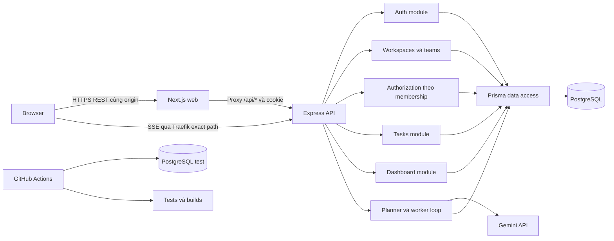
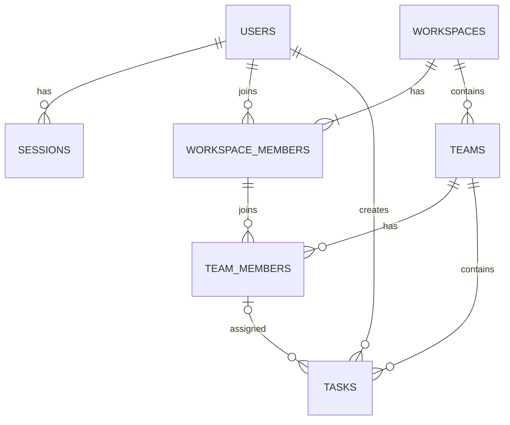
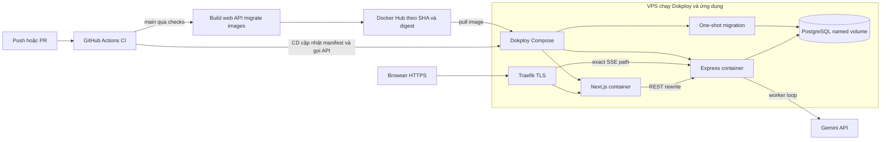

# Task Management System — Kiến trúc và thiết kế

## 1. Bối cảnh và trạng thái

- Nguồn: [đề bài tuyển dụng](../../README.md); vai trò Fullstack, thời hạn **2 ngày**.
- Phạm vi đã xác nhận: **workspace → team → task**, team có thành viên/quyền riêng; MVP, **6 mục cộng điểm** và **AI Smart Task Planner toàn bộ MVP + nâng cao**, Gemini BYOK theo tài khoản, subtask checklist và **realtime không polling**.
- Kiến trúc được chọn: **Next.js frontend + Express backend riêng**, TypeScript, PostgreSQL và Prisma, xác nhận ngày 09/10/2026.
- Đây là thiết kế trước khi code; checklist là tiêu chí cần hoàn thành. Giới hạn trường, deadline, session và phân trang là quyết định cho phần đề bài chưa quy định.
- Workspace/team là mở rộng do chủ repo yêu cầu ngày 09/10/2026, thay thế thiết kế task cá nhân trước đó. "Dữ liệu của mình" được diễn giải là dữ liệu người dùng có quyền qua membership; task được chia sẻ trong team. README gốc được giữ làm đề bài, tài liệu này ghi rõ phần mở rộng.
- DevOps đã chốt: **CI/CD bằng GitHub Actions → Docker Hub → Dokploy → VPS**. Chưa rõ quỹ giờ, VPS/domain và quyền truy cập thực tế; chuẩn bị đầu ngày 1, không mặc định đăng ký dịch vụ trả phí.

### Mục tiêu

Reviewer có thể chạy ứng dụng từ hướng dẫn, đăng nhập, quản lý task, kiểm tra API, xem CI và mở demo. Người làm bài có thể giải thích cách cô lập dữ liệu, mô hình database, phân trang Kanban và đánh đổi kiến trúc.

Đọc [PRD tổng thể](../01-requirements/task-management-system-prd.md), tổng quan/BE mục 4; domain/quyền/DB mục 5–7; API mục 8; FE mục 9; DevOps mục 11–12; [AI planner chi tiết](ai-and-realtime-technical-design.md) và [AI PRD nguồn](../01-requirements/ai-smart-task-planner-prd.md); [realtime SSE/FE/BE/DevOps](ai-and-realtime-technical-design.md). Decisions/limits là thiết kế, chưa là kết quả đo.

### Ranh giới

Bao gồm workspace/team/membership, task assignment và AI planner đầy đủ theo tài liệu liên kết; Project trong spec ánh xạ thành team, không thêm entity Project. Không thêm email invitation, chat, màn hình lịch task, upload, notification, OAuth hoặc quên mật khẩu. Calendar tạm là deadline picker, chưa chốt màn hình lịch riêng; ảnh README là tham khảo.

Trong bản hai ngày: sửa tên workspace/team; không chuyển OWNER, không xóa workspace/team, không chuyển task giữa team. CRUD task vẫn đầy đủ. Thêm thành viên bằng email của tài khoản đã đăng ký, không tự tạo tài khoản hoặc tự động tham gia mọi team.

Chỉ bổ sung công nghệ/tính năng cộng điểm khác khi chủ repo yêu cầu. Các thư viện trong mục 3 phục vụ trực tiếp phạm vi đã chốt.

## 2. Requirements traceability

Phạm vi sản phẩm và acceptance IDs là nguồn chuẩn trong [Task Management System PRD tổng thể](../01-requirements/task-management-system-prd.md#7-yêu-cầu-và-tiêu-chí-nghiệm-thu-tổng-thể). PRD nối đề bài, workspace/team, sáu bonus, AI1/AI2 và RT1. Tài liệu kiến trúc quy định cách hiện thực; mục 10 mô tả kiểm chứng và checklist bàn giao. Không xem quyết định kỹ thuật là yêu cầu sản phẩm mới nếu PRD chưa ghi nhận.

## 3. Các phương án và quyết định công nghệ

| Phương án | Ưu điểm | Chi phí/đánh đổi | Kết luận |
| --- | --- | --- | --- |
| Next.js fullstack với Route Handlers | Một app deployment; cookie cùng origin; ít cấu hình vận hành | API và FE chung runtime; cần chủ động tách service/data access và OpenAPI | Khả thi nếu ưu tiên giảm số dịch vụ; đã cân nhắc |
| **Express + Next.js** | API riêng rõ ràng; dễ thể hiện backend, authorization và integration tests; module nhỏ | Hai app build/runtime; cần proxy và cấu hình deploy nhất quán | **Đã chọn** |
| NestJS + Next.js | Module, DI, guards và tích hợp Swagger có quy ước | Tăng setup/boilerplate nếu chưa quen; vẫn hai app runtime | Chỉ chọn khi người thực hiện đã quen NestJS; không dùng cho thiết kế này |

Next.js có HTTP endpoints và hỗ trợ proxy tới backend; không bắt buộc tách backend chỉ vì dùng Node.js. Lựa chọn Express ở đây phục vụ việc tổ chức và trình bày API riêng. [Next.js Backend for Frontend](https://nextjs.org/docs/app/guides/backend-for-frontend)

### Stack dự kiến

| Thành phần | Lựa chọn | Lý do |
| --- | --- | --- |
| Runtime | Node.js LTS còn hỗ trợ tại lúc setup | Cùng runtime cho web/API/CI/Docker |
| Ngôn ngữ | TypeScript strict | Kiểu dữ liệu rõ giữa route, service, DB và UI |
| Frontend | Next.js App Router, React | Theo lựa chọn của chủ repo; layout/routes và UI tương tác |
| UI components | shadcn/ui | Dashboard, Sidebar, Task Table, Dialog, Form, Calendar; source do dự án quản lý |
| Animation | React Bits, biến thể TypeScript + Tailwind | Hiệu ứng xuất hiện, chuyển cảnh, text và tương tác được chọn ở mục 9 |
| Styling | Tailwind CSS + semantic design tokens | Thống nhất màu, typography, spacing, trạng thái và responsive |
| Kéo thả | dnd-kit cho React | Phục vụ trực tiếp Kanban; chốt package/API từ tài liệu lúc setup |
| Backend | Express | REST API nhỏ, middleware rõ |
| Validation | Zod | Kiểm tra body/query/params; tái sử dụng schema để tạo OpenAPI |
| AI planning | Gemini API theo user BYOK, @google/genai, PostgreSQL jobs/versions/credentials | Worker event-driven dùng key của creator; structured draft, import nguyên tử; không thêm queue service |
| Realtime | Native SSE/EventSource, PostgreSQL outbox + LISTEN/NOTIFY | Push task/AI/quyền, replay/resync; không polling hoặc broker mới |
| Database | PostgreSQL | Quan hệ workspace/team/membership, FK, enums, aggregation, transactions |
| ORM | Prisma | Schema, migrations, typed queries và seed |
| Password/session | Argon2id + opaque session trong DB | Hash an toàn; logout thu hồi được phía server |
| API docs | OpenAPI 3.x + Swagger UI | Reviewer kiểm tra API và contract |
| Kiểm thử | Vitest + Supertest + PostgreSQL test riêng | Gọi HTTP thực của Express, kiểm tra DB/membership/authorization |
| Vận hành | Docker Compose, GitHub Actions, Docker Hub, Dokploy trên VPS | CI kiểm tra/build/push image; Dokploy deploy và vận hành trên VPS |
| State phía FE | fetch và state/hooks theo tính năng | Đủ cho quy mô; không thêm global store khi chưa cần |

Khóa phiên bản đã kiểm tra tương thích trong lockfile, Node version file và Docker image. Không sử dụng tag `latest` trong bản bàn giao. Không chốt số version chưa kiểm tra tương thích giữa Next.js, Prisma và Node.js.

## 4. Kiến trúc tổng thể

Chọn **modular monolith cho BE, FE chia theo feature, hai Node processes cùng một public origin và một PostgreSQL**. Module là ranh giới code/nghiệp vụ, không phải microservice; transaction của membership và task vẫn nằm trong một DB. Next.js làm UI và HTTP proxy, Express là nguồn quyết định nghiệp vụ/quyền, DB giữ invariants, DevOps giữ vòng đời và dữ liệu.

| Ranh giới | Chủ sở hữu | Quy tắc phối hợp |
| --- | --- | --- |
| UI/state | Next.js + React | Route chứa workspace/team; FE không quyết định quyền thật hoặc gọi DB |
| HTTP/session | Express | Contract JSON, cookie host-only qua web origin, request ID, lỗi thống nhất |
| Authorization/write | Policy + services | Membership hiện tại và role dưới lock; chỉ trả thành công sau commit |
| Persistence | PostgreSQL + Prisma | Composite FK, transaction, pool có giới hạn; không cascade task khi revoke |
| Release/runtime | GitHub Actions → Docker Hub → Dokploy/VPS | Cùng commit cho web/API/migrations; DB tồn tại độc lập app image |



- Browser gọi `/api/...` cùng origin; REST qua Next rewrites, production SSE `/api/realtime/events` qua Traefik trực tiếp Express theo [topology realtime](ai-and-realtime-technical-design.md#152-luồng-và-topology). Next không chứa nghiệp vụ. [Next.js rewrites](https://nextjs.org/docs/app/api-reference/config/next-config-js/rewrites)
- Cookie/`Set-Cookie` qua proxy, không Domain nội bộ. Express quyết định auth/quyền/validation/nghiệp vụ; redirect/ẩn nút FE chỉ phục vụ UX.
- Trang dữ liệu workspace/team dùng client fetch và `Cache-Control: no-store` cho API. Không tạo static page/cache chung chứa dữ liệu được bảo vệ.
- npm workspaces; một web/API instance cho demo, worker AI nằm trong API process; chưa mở rộng scale hoặc thêm monorepo orchestration.

### Ranh giới module API

Luồng request: route → validate → authenticate → authorize workspace/team/action → controller → service → Prisma → serialize response. Service kiểm tra lại quyền cùng transaction khi mutation có thể chạy đồng thời với thay đổi membership.

| Module | Trách nhiệm |
| --- | --- |
| auth | Register/login/logout/me; password hash; session creation/validation |
| workspaces | Tạo/list/sửa tên workspace; membership và workspace roles |
| teams | Tạo/list/sửa tên team; team membership và assignee candidates |
| tasks | CRUD/search/filter/pagination/assignment; AI thêm checklist/criteria/estimate/schedule/dependency, vẫn scope theo team |
| planner | Gemini adapter, durable jobs, năm stages thực, versions/history/diff/locks, atomic confirm; chi tiết tài liệu AI |
| realtime | Transactional outbox/clock, LISTEN dispatcher, SSE auth/replay/limits; event sau commit, worker wake không polling |
| dashboard | Aggregation/upcoming chỉ trên team người dùng được xem |
| shared | Authorization policy, error mapping, request ID, logging, origin check, rate limit, config |

Controller xử lý HTTP; service xử lý nghiệp vụ; policy dùng chung quyết định quyền theo action, workspace role và team membership. Data access luôn có workspace/team scope. Không tạo generic repository/base service hay nhiều lớp abstraction chỉ để bọc lại Prisma.

### Kiến trúc BE: module, request và runtime

| Cách tổ chức | Đánh đổi | Quyết định |
| --- | --- | --- |
| Module theo feature, layers nhỏ bên trong | Nghiệp vụ gần nhau; ít boilerplate, vẫn cần kỷ luật dependency | Chọn: routes/schema/controller/service/queries/DTO theo từng module |
| Global controllers/services/repositories | Dễ khởi đầu; một feature rải nhiều thư mục | Không ưu tiên cho workspace/team nhiều action |
| Hexagonal với ports/adapters/use cases | Đổi infrastructure thuận tiện; tăng interfaces/mapping | Chưa cần trong bài hai ngày |

- Controller nhận input đã validate và identity; service điều phối policy/transaction; queries nhận explicit scope và Prisma client hoặc `tx`. Policy là rules trên dữ liệu membership/resource đã đọc, không gọi HTTP.
- Service của task không gọi controller của team; dùng policy/query chia sẻ nhỏ. Queries trong transaction luôn dùng cùng `tx`, không quay về global Prisma hoặc tự mở transaction lồng.
- Pipeline Express 5: request ID/log/security headers → public health/docs → origin/content-type mutations → limiter → parsers có scope (core 32 KiB, planner 256 KiB) → auth/routes → JSON 404 → error middleware. Parser planner không chạy sau parser core đã consume body; protected routes auth trước validation nghiệp vụ, service recheck quyền.
- Async handler phải return/await promise; Express 5 chuyển rejected promise sang error middleware. Error middleware bốn tham số ở cuối, `headersSent` thì delegate; timers/background promises cần xử lý riêng. [Express error handling](https://expressjs.com/en/guide/error-handling/)

| Vấn đề BE | Cách giải quyết và giới hạn | Kiểm chứng cần có |
| --- | --- | --- |
| Mass assignment/lộ model nội bộ | Zod strict, scope/identity truyền riêng; DTO projection, không spread body vào Prisma hoặc trả cả model | Inject role/scope; response không chứa hash/session |
| Lọc sau khi fetch làm lộ total | Một scope builder cho rows/count/dashboard/roster; SQL filter membership, không tải mọi task rồi lọc JS | So sánh rows và total giữa team/roles |
| N+1 và aggregate chậm | Select public fields; relation joins/batch theo page; count/group tại DB; không tính dashboard bằng tải mọi task | Query count và EXPLAIN trên dataset đại diện; chỉ thêm index khi cần |
| Cạn connections | Một PrismaClient/pool mỗi API process, không disconnect mỗi request; pool cap theo DB budget và có headroom migration | Quan sát active/waiting connections, pool timeout |
| Argon2 chiếm CPU/RAM | Async hash/verify ngoài transaction; limiter trước hashing, concurrency có giới hạn; async không làm mất chi phí CPU | Login burst không làm ready endpoint treo; không sync IO trong handler; [Node runtime guidance](https://nodejs.org/learn/asynchronous-work/dont-block-the-event-loop) |
| Deadlock/role race | Mutations READ COMMITTED + locks mục 6; dashboard RepeatableRead ngắn; retry tối đa 2 lần thêm chỉ khi DB xác nhận abort, mỗi lần đọc/authorize lại | Race tests; không retry permission/validation hoặc HTTP create |
| Process dừng giữa request | server.ts validate env/connect/commit LISTEN/catch-up rồi worker; SIGTERM stop claims/ready=false, close SSE, drain REST/worker/checkpoint-or-expire trước đóng pool; 30s | Commit giữ nguyên; paid attempt chưa rõ không auto replay |

Prisma major phải pin trước code: tham chiếu transaction/pool ở đây là **v7**, không mặc định API latest tương đương. V7 driver adapter lấy cấu hình pool từ driver (`pg` max/connectionTimeoutMillis), khác v6 URL options. Nếu chọn major khác, xác minh lại transaction/isolation/driver/migration API trước áp dụng; không nâng major giữa bài. [Prisma v7 pools](https://www.prisma.io/docs/orm/v7/prisma-client/setup-and-configuration/databases-connections/connection-pool), [v7 transactions](https://www.prisma.io/docs/orm/v7/prisma-client/queries/transactions)

Graceful shutdown không đóng DB trước request đang chạy; liveness chỉ process, readiness là startup/draining + DB probe có timeout, không chạy migration/seed trong probe. Fatal unexpected runtime error log đã redacted và exit để platform restart. [Express health/shutdown](https://expressjs.com/en/advanced/healthcheck-graceful-shutdown/)

### Luồng xuyên FE → BE → DB khi chuyển status

```mermaid
sequenceDiagram
    participant UI as Browser board
    participant Web as Next.js proxy
    participant API as Express service
    participant DB as PostgreSQL
    UI->>UI: Giữ snapshot card và optimistic status
    UI->>Web: PATCH cùng origin, cookie và scope URL
    Web->>API: Forward Cookie, Origin và request ID
    API->>DB: Validate session; BEGIN, lock memberships, check policy
    API->>DB: UPDATE task đúng scope; COMMIT
    DB-->>API: Commit thành công
    API-->>Web: 200 TaskDTO, Cache-Control no-store
    Web-->>UI: Kết quả mutation
    UI->>Web: GET hai cột và dashboard đúng scope
    Note over UI,DB: Mất response không chứng minh rollback; refetch để đối soát
```

Login dùng cùng HTTP path: origin/validation/limiter → verify hash ngoài transaction → session write/commit → Set-Cookie qua Next → FE gọi me/workspaces. Không trả cookie trước khi session commit. Backend timeout không được mô phỏng chỉ bằng Promise.race vì request hết thời gian không tự hủy query/transaction DB.

### Cấu trúc repo mục tiêu

```text
apps/api/
  src/modules/{auth,workspaces,teams,tasks,dashboard,planner,realtime}/
  src/shared/{authorization,errors,config,logging}/
  src/{app.ts,server.ts}        # App factory; runtime lifecycle
  prisma/{schema.prisma,migrations/,seed.ts}
  tests/integration/
  Dockerfile; .env.example
apps/web/
  src/app/                     # Routes/layouts và error boundaries
  src/features/{auth,workspaces,teams,tasks,dashboard,planner}/
  src/components/ui/; src/lib/{api-client.ts,realtime-provider.tsx}
  Dockerfile; .env.example
docs/README.md; docs/01-requirements/{task-management-system-prd.md,ai-smart-task-planner-prd.md}; docs/02-architecture/{system-architecture.md,ai-and-realtime-technical-design.md}; .github/workflows/{ci.yml,release.yml}
docker-compose.dev.yml; docker-compose.prod.yml; package.json; package-lock.json; README.md
```

Đây là mô tả cấu trúc tương lai, không phải các file đã được tạo. DTO phía FE theo OpenAPI; không import Prisma models/client vào browser. Chỉ tạo shared package nếu thực tế xuất hiện contract dùng chung cần quản lý.

## 5. Quy tắc nghiệp vụ

### 5.1 Tài khoản

- Email hợp lệ, tối đa 254 ký tự; trim và lowercase trước truy vấn/lưu; unique trong DB.
- Password dài 8–128 ký tự; không trim hoặc lowercase password.
- Display name tùy chọn, nếu cung cấp thì trim, dài 1–80 ký tự.
- Register thành công tạo user và session, trả user công khai và cookie đăng nhập.
- Tài khoản là toàn hệ thống, có thể tham gia nhiều workspace/team. Register không tự cấp quyền workspace; onboarding tạo workspace hoặc chọn workspace đã được thêm vào.
- Login sai email/password trả cùng một thông báo `INVALID_CREDENTIALS`.
- Logout chỉ kết thúc session hiện tại. Không có tính năng logout toàn bộ thiết bị trong phạm vi này.

### 5.2 Task

| Trường | Quy tắc |
| --- | --- |
| title | Bắt buộc; trim; 1–200 ký tự |
| description | Tùy chọn; tối đa 5.000 ký tự; mặc định chuỗi rỗng |
| status | TODO / IN_PROGRESS / DONE; tạo mới mặc định TODO |
| priority | LOW / MEDIUM / HIGH; tạo mới mặc định MEDIUM |
| dueDate | Tùy chọn; null hoặc ngày hợp lệ `YYYY-MM-DD`, năm 0001–9999 |
| workspaceId/teamId | Lấy từ URL đã kiểm tra quyền và quan hệ; không cho đổi qua body |
| createdBy | Lấy userId từ session khi tạo; bất biến, giữ làm lịch sử sau khi người tạo rời nhóm |
| assigneeId | UUID tùy chọn hoặc null; phải là thành viên hiện tại của chính team |
| createdAt/updatedAt | Do server tạo/cập nhật; trả ISO timestamp UTC |

- Cho phép chuyển qua lại giữa cả ba status, bao gồm mở lại task DONE.
- Deadline trong quá khứ vẫn hợp lệ; UI thể hiện quá hạn nếu task chưa DONE.
- PATCH chỉ cập nhật trường được gửi; `dueDate: null` xóa deadline, `assigneeId: null` bỏ giao việc; title/status/priority không nhận null.
- Body rỗng hoặc có trường không được phép, kể cả ownerId/workspaceId/teamId/createdBy, bị từ chối với lỗi validation.
- Delete là hard delete, cần xác nhận ở UI; không triển khai restore/soft delete.
- Member trong team tạo/sửa mọi task trong team, xóa task mình tạo; OWNER/ADMIN quản lý mọi task của workspace. Giao việc không tự tạo quyền truy cập và không hạn chế quyền sửa chỉ cho assignee.
- Không lưu thứ tự card. Drag/drop chỉ thay đổi status.
- Nếu hai tab sửa task đồng thời: lần ghi thành công sau cùng thắng; SSE báo thay đổi để reconcile, giữ editor dirty. Realtime không thêm optimistic locking cho CRUD lõi; planner vẫn có CAS.

### 5.2a Workspace, team và phân quyền

Workspace là ranh giới dữ liệu cấp tổ chức; team là ranh giới chia sẻ task bên trong workspace. User có thể thuộc nhiều workspace và nhiều team. Task bắt buộc thuộc đúng một team, không giữ thêm loại task cá nhân song song.

| Thao tác | OWNER | ADMIN | MEMBER |
| --- | --- | --- | --- |
| Xem/sửa task | Mọi team trong workspace | Mọi team trong workspace | Chỉ team mình tham gia |
| Tạo task | Mọi team | Mọi team | Chỉ team mình tham gia |
| Xóa task | Mọi task | Mọi task | Task mình tạo trong team còn tham gia |
| Tạo team/sửa tên workspace, team | Có | Có | Không |
| Xem/quản lý workspace members | Có | Xem roster; chỉ thêm/gỡ MEMBER | Không |
| Cấp/bỏ ADMIN | Có | Không | Không |
| Quản lý team membership | Có | Có | Không |
| Xem roster team để giao task | Mọi team | Mọi team | Chỉ team mình tham gia |

- Mỗi workspace có đúng một OWNER; tạo workspace và OWNER membership trong cùng transaction. Role OWNER bất biến trong bản này; không cho gỡ/demote owner, kể cả tự thao tác.
- OWNER đổi ADMIN ↔ MEMBER cho người khác. ADMIN không đổi role, không gỡ OWNER/ADMIN và không tự nâng quyền.
- Tên workspace/team trim, 1–100 ký tự; tên không cần unique, ID quyết định scope.
- OWNER/ADMIN thêm workspace member bằng email normalized của tài khoản đã có; mặc định MEMBER. Không có API tìm kiếm danh bạ user toàn hệ thống; không trả dữ liệu ngoài tài khoản email cần thêm.
- Muốn thêm team member, user phải là workspace member trước; không tự cấp workspace membership từ request thêm team.
- OWNER/ADMIN không cần là team member để quản lý task. Muốn được giao task, họ vẫn phải được thêm vào team.
- Gỡ team member: clear assignee trên task của người đó trong team rồi xóa membership, trong cùng transaction. Task và createdBy giữ nguyên.
- Gỡ workspace member: clear assignment trong mọi team workspace, xóa team memberships rồi workspace membership cùng transaction; không xóa tasks họ từng tạo.
- Request dữ liệu kiểm tra membership hiện tại; không giữ roles/membership trong cookie hoặc cache dài hạn. Người bị gỡ chỉ mất quyền nhóm bị gỡ, session và workspace khác vẫn hoạt động.
- Chưa hỗ trợ leave riêng/self-service, chuyển OWNER, xóa container hay move task. Các thao tác quản lý không được triển khai phải ẩn khỏi UI và không có endpoint ghi tương ứng.

### 5.3 Search, filter và phân trang

- `q`: trim, tối đa 200 ký tự; rỗng tương đương không tìm kiếm.
- Search substring theo title, không phân biệt hoa/thường; ký tự `%` và `_` được hiểu là ký tự người dùng, không cho mở rộng wildcard SQL ngoài ý định.
- `status` và `priority` mỗi tham số một enum; query không hợp lệ trả 400.
- Search, status, priority, teamId và assigneeId kết hợp bằng AND; bắt buộc scope workspace và tập team được phép xem.
- `teamId` tùy chọn: phải thuộc workspace và người gọi được xem; không hợp lệ theo scope trả 404. `assigneeId` là UUID filter tùy chọn, chỉ lọc trên tập task đã được cấp quyền. My Tasks là assigneeId = user hiện tại, không phải createdBy.
- `page`: số nguyên ≥ 1, mặc định 1; `pageSize`: số nguyên 1–100, mặc định 20.
- Sort cố định `createdAt DESC, id DESC`; không cung cấp sort tùy ý.
- Page vượt cuối trả `data: []`, total giữ đúng; khi total = 0 thì totalPages = 0.
- Offset pagination đủ cho dữ liệu demo. Thêm/xóa trong lúc chuyển page có thể dịch vị trí; ID tie-breaker chỉ bảo đảm thứ tự xác định trên tập dữ liệu không đổi.

### 5.4 Deadline và dashboard

Chọn `dueDate` là ngày lịch, không có giờ. PostgreSQL `DATE` phù hợp dữ liệu này; audit timestamps dùng `TIMESTAMPTZ`. [PostgreSQL date/time types](https://www.postgresql.org/docs/current/datatype-datetime.html)

- Múi giờ nghiệp vụ cố định: **Asia/Ho_Chi_Minh**. Server quyết định `today`; không lấy ngày từ browser để aggregate.
- Sắp đến hạn: status khác DONE, deadline từ **hôm nay đến hôm nay + 6 ngày**, bao gồm cả hai đầu; tổng cộng 7 ngày lịch.
- Quá hạn: status khác DONE và deadline < today. Task không có deadline không thuộc hai nhóm trên.
- Upcoming sort `dueDate ASC, createdAt ASC, id ASC`; dashboard hiển thị tối đa 5 task và `upcomingTotal` của toàn bộ cửa sổ.
- Dashboard bắt buộc chọn workspace, có thể chọn team. OWNER/ADMIN tính mọi team workspace; MEMBER chỉ tính team đang tham gia. Không dùng filter q/status/priority/assignee của board/list cho các số đếm dashboard.
- Đọc counts, upcoming và upcomingTotal trong cùng transaction với isolation `RepeatableRead` để dùng chung snapshot. Transaction mặc định `Read Committed` có thể có snapshot khác nhau giữa các query. [PostgreSQL transaction isolation](https://www.postgresql.org/docs/current/transaction-iso.html)
- Kiểm tra role, tập team được xem và các query dashboard trong cùng snapshot để không đếm nhầm scope khi membership thay đổi.
- Sau CRUD/chuyển status/thay membership, tải lại dashboard. Sau khi trở lại tab hoặc qua ngày mới, tải lại để tránh số liệu deadline cũ.

## 6. Thiết kế database lõi và mở rộng AI



| Bảng | Columns chính; PK/FK chi tiết ở mục constraints |
| --- | --- |
| users | id UUID PK, email VARCHAR(254) UNIQUE, password_hash TEXT, display_name VARCHAR(80) nullable, created_at/updated_at TIMESTAMPTZ |
| sessions | id UUID PK, user_id UUID FK, token_hash CHAR(64) UNIQUE, expires_at/created_at TIMESTAMPTZ |
| user_gemini_credentials | user_id UUID PK/FK, provider=GEMINI, ciphertext, nonce, auth_tag, encryption_key_version, credential_revision, model, verified_at, created_at/updated_at |
| workspaces | id UUID PK, name VARCHAR(100), created_at/updated_at TIMESTAMPTZ |
| workspace_members | workspace_id/user_id UUID compound PK, role enum, created_at TIMESTAMPTZ |
| teams | id UUID PK, workspace_id UUID FK, name VARCHAR(100), created_at/updated_at TIMESTAMPTZ |
| team_members | workspace_id/team_id/user_id UUID, compound PK team_id/user_id, created_at TIMESTAMPTZ |
| tasks | id UUID PK, workspace_id/team_id/created_by UUID, assignee_id UUID nullable, title VARCHAR(200), description TEXT, status/priority enums, due_date DATE nullable, created_at/updated_at TIMESTAMPTZ |

### Constraints và indexes

- Bảy bảng lõi + một bảng credential BYOK + bảy bảng AI/checklist/dependencies + [hai realtime](ai-and-realtime-technical-design.md#154-hai-bảng-và-commit-safe-cursors) = **17 bảng**; tasks có fields bổ sung. Credential schema, encryption và các AI FKs xem [AI persistence](ai-and-realtime-technical-design.md#7-persistence-và-invariants).
- Workspace members PK `(workspace_id, user_id)`, role enum OWNER/ADMIN/MEMBER; partial UNIQUE `(workspace_id) WHERE role = 'OWNER'` chặn nhiều OWNER. Chính sách tạo/không gỡ OWNER bảo đảm ít nhất một OWNER qua API; partial index chỉ bảo đảm tối đa một, không tuyên bố constraint này tự bảo đảm đúng một.
- Teams FK workspace; UNIQUE `(workspace_id, id)` làm đích composite FK. Team members PK `(team_id, user_id)`, FK `(workspace_id, team_id)` → teams và `(workspace_id, user_id)` → workspace_members.
- Tasks FK `(workspace_id, team_id)` → teams; FK `(team_id, assignee_id)` → team_members. Assignee nullable; composite FK với null bỏ qua check khi chưa giao việc.
- `tasks.created_by` → users.id với RESTRICT, độc lập membership để giữ lịch sử. `sessions.user_id` → users.id ON DELETE CASCADE. Chưa có API xóa tài khoản.
- `user_gemini_credentials.user_id` là PK/FK → users.id ON DELETE CASCADE, tối đa một Gemini API key mỗi tài khoản và không hỗ trợ provider/key type khác; user tự nhập key cùng model muốn dùng trong phần cài đặt tài khoản. API chỉ cho chủ tài khoản quản lý. Key được mã hóa AES-256-GCM, gắn `user_id` và provider làm AAD; keyring mã hóa của hệ thống là secret API riêng, không phải Gemini key và không nhập trên UI.
- Các FK container/membership dùng RESTRICT; gỡ member phải clear assignee/xóa team memberships trước khi xóa workspace membership. Không cascade xóa task khi gỡ user khỏi nhóm.
- Composite keys ngăn team/assignee sai scope ngay tại DB; CHECK không dùng để truy vấn membership bảng khác. [PostgreSQL constraints](https://www.postgresql.org/docs/current/ddl-constraints.html)
- `users.email` normalized, UNIQUE và NOT NULL; hash password NOT NULL; display_name nullable.
- Workspace/team name VARCHAR(100), NOT NULL, CHECK sau trim không rỗng; timestamps và các khóa scope/creator không nullable. Role workspace member NOT NULL.
- `tasks.title` VARCHAR(200), NOT NULL và CHECK title sau trim không rỗng; description NOT NULL DEFAULT ''; CHECK length ≤ 5.000.
- status/priority dùng PostgreSQL enums với các giá trị mục 5 và defaults tương ứng.
- `due_date` nullable; CHECK giới hạn năm theo contract nếu ghi trực tiếp DB.
- `sessions.token_hash`: SHA-256 hex 64 ký tự, UNIQUE/NOT NULL; expiry và createdAt NOT NULL; CHECK expiry > createdAt.
- Index workspace_members `(user_id, workspace_id)` và team_members `(workspace_id, user_id, team_id)` cho tập quyền; FK phía referencing cần index phù hợp, không giả định PostgreSQL tự tạo tất cả.
- Index tasks `(workspace_id, team_id, created_at DESC, id DESC)` cho list và `(workspace_id, team_id, status, created_at DESC, id DESC)` cho board.
- Index tasks `(workspace_id, due_date)` cho upcoming, `(team_id, assignee_id)` phục vụ FK/removal; sessions `(user_id)` và `(expires_at)` cho cleanup.
- Không mặc định tạo index cho mọi cột. Search substring scan tập task đã scope; full-text/trigram chỉ cân nhắc khi quy mô thực tế cần.
- Prisma schema mô tả quan hệ/type/default; CHECK và partial UNIQUE cần bổ sung trong SQL migration nếu ORM version đã chọn chưa mô tả được, và được version control.

### Transactions và thay đổi quyền

- Tạo workspace + OWNER membership là atomic; thêm team member chỉ thành công khi membership workspace hợp lệ.
- Mọi mutation cần quyền (task, workspace, team, members và role) kiểm tra quyền trong transaction sau khi khóa actor workspace membership/role bằng FOR SHARE; MEMBER thao tác task còn khóa actor team membership. Giữ khóa tới commit. Admin đang bị demote không được dùng kết quả kiểm tra cũ để ghi sau khi demote commit. [PostgreSQL row locks](https://www.postgresql.org/docs/current/explicit-locking.html)
- Thay role/gỡ workspace member khóa target workspace membership bằng FOR UPDATE rồi kiểm tra lại role dưới lock; ADMIN chỉ gỡ target vẫn là MEMBER, không dựa vào role đọc trước khóa. Thêm team member bảo vệ workspace membership target bằng FOR KEY SHARE; assignment bảo vệ target team membership bằng FOR KEY SHARE.
- Gỡ team member khóa target team_members row bằng FOR UPDATE trước clear assignment. Gỡ workspace member khóa target workspace_members row và **mọi team_members row của target trong workspace bằng FOR UPDATE** trước clear assignments/xóa membership; không chỉ khóa workspace row. Các khóa chặn assignment/thêm membership lọt vào khoảng giữa clear và delete.
- Thứ tự lõi: workspace_members `(workspace_id,user_id)` → team_members `(team_id,user_id)` → team graph/plan locks khi cần → tasks theo id; lấy chế độ mạnh nhất cần từ đầu. Thu hồi/clear assignments atomic, retry deadlock hữu hạn. AI graph/import locks mở rộng theo companion; không giữ lock qua Gemini HTTP.
- Request đã được cho phép trong transaction có thể hoàn tất trước khi revoke commit. Sau revoke commit, request mới không được dùng quyền cũ; read đang chạy không bị hủy hồi tố.

### Migration và seed

- Dev tạo migration; môi trường CI/demo áp dụng migration đã commit bằng `prisma migrate deploy`. Không dùng `db push` làm quy trình bàn giao. [Prisma applying migrations](https://www.prisma.io/docs/orm/migrations/applying-a-migration)
- Seed là thao tác tường minh sau migration; không chạy mỗi lần API restart.
- Seed hai workspaces; workspace A có team Backend/Frontend và tài khoản owner, admin, member Backend, member Frontend, member cả hai; thêm owner riêng workspace B để kiểm tra cô lập.
- Khoảng 40 task Backend, 25 task Frontend, 8 task workspace B; đủ statuses/priorities/pages, nhiều creators/assignees, task chưa giao; deadline hôm qua/hôm nay/+6/+7/null.
- UUID seed cố định và upsert giúp không nhân bản dữ liệu khi chạy lại. Deadline được tạo tương đối với ngày chạy seed; ghi rõ seed lại sẽ reset dữ liệu mẫu tương ứng.
- Mật khẩu demo qua env seed `DEMO_PASSWORD`, hash từng user bằng cùng cơ chế auth; không dùng mật khẩu thật. Public demo chỉ chứa dữ liệu giả, README ghi các persona và phạm vi quyền của từng tài khoản.
- Không seed tài khoản demo vào database production khác mục đích nếu chưa bật chế độ demo một cách tường minh.
- Có bước xóa sessions hết hạn; expiry vẫn phải được kiểm tra trên mọi request dù cleanup chưa chạy.

## 7. Authentication và bảo mật

### Session flow

1. Register/login nhận JSON hợp lệ, kiểm tra origin/rate limit; hash hoặc verify password.
2. Tạo token ngẫu nhiên 32 byte từ CSPRNG; DB chỉ lưu SHA-256 token, userId và expiry.
3. Trả cookie `tm_session` chứa token gốc, `HttpOnly`, `SameSite=Lax`, `Path=/`, không có Domain; `Secure` ở môi trường HTTPS.
4. Session có hạn cố định 7 ngày; cookie Max-Age tương ứng. Request hash token, tìm session chưa hết hạn và nạp user.
5. Login mới thay thế session hiện tại của browser nếu có; session mới luôn dùng token mới.
6. Logout xóa session DB hiện tại và xóa cookie với cùng path/attributes. Token được copy trước logout cũng không dùng lại được.

Không lưu token trong localStorage. Dùng Argon2id với tối thiểu memory 19 MiB, iterations 2, parallelism 1; kiểm tra chi phí thực tế trên máy deploy. [OWASP Password Storage](https://cheatsheetseries.owasp.org/cheatsheets/Password_Storage_Cheat_Sheet.html)

Cookie policy, token ngẫu nhiên và thu hồi session theo phía server theo hướng dẫn [OWASP Session Management](https://cheatsheetseries.owasp.org/cheatsheets/Session_Management_Cheat_Sheet.html).

### Authorization và chống CSRF

- Mọi query bắt buộc scope workspace và team qua membership/role hiện tại; createdBy/assigneeId không phải điều kiện thay thế quyền truy cập.
- Với MEMBER, list/search/dashboard/roster chỉ thuộc team đã tham gia; OWNER/ADMIN chỉ có quyền trong workspace có role đó, không phải admin toàn hệ thống.
- Workspace/team/task không tồn tại hoặc ngoài phạm vi được xem trả 404. Nếu thấy resource nhưng không có quyền action (ví dụ xóa task người khác), trả 403 FORBIDDEN.
- URL scope phải khớp resource thật: không nhận workspace A rồi query task/team B chỉ theo ID. Body roles/IDs đều validate theo action; cookie không quyết định workspace role.
- Dùng policy dùng chung trên mọi endpoint và deny by default; test cả các đường list/count/roster và các actions đổi role/membership. [OWASP Authorization](https://cheatsheetseries.owasp.org/cheatsheets/Authorization_Cheat_Sheet.html)
- Cho mọi POST/PATCH/DELETE, gồm auth: Origin phải trùng `APP_ORIGIN` cấu hình tin cậy. Nếu thiếu Origin, xác minh origin của Referer; thiếu cả hai hoặc không khớp thì 403.
- POST/PATCH có body chỉ nhận `application/json`; không chấp nhận form content types. Không bật CORS cho origin tùy ý.
- Swagger cùng origin thực hiện request hợp lệ; CLI/tests phải gửi Origin theo contract. DELETE/logout không được bỏ qua origin check chỉ vì không có body.
- Giữ Origin qua proxy, không suy luận từ Host/X-Forwarded-* client; SameSite hỗ trợ, origin/content-type checks bắt buộc. [OWASP CSRF Prevention](https://cheatsheetseries.owasp.org/cheatsheets/Cross-Site_Request_Forgery_Prevention_Cheat_Sheet.html)

### Kiểm soát khác

- HTTPS cho demo; headers bảo mật cho API và web; cấu hình CSP riêng phù hợp Next.js/Swagger thay vì áp một policy khiến UI không chạy.
- Giới hạn body core 32 KiB/planner draft 256 KiB, parsers theo route và proxy đồng nhất; server validation quyết định. Gemini BYOK chỉ được nhập tạm rồi gửi HTTPS tới API; không có API đọc raw key, không lưu browser storage, log, response, prompt/context/job/outbox/SSE hoặc image. Consent/context tối thiểu, quotas và ACL drafts/jobs xem tài liệu AI.
- Rate limit register/login theo IP và email normalized; ban đầu 10 lần/phút/IP và 5 lần/phút/email, trả 429 + Retry-After. Bộ nhớ trong process chỉ phù hợp demo một API instance, reset khi restart.
- Trust proxy chỉ theo proxy/hop tin cậy của môi trường đã chọn; không dùng thiết lập tin mọi nguồn để lấy client IP.
- Không log password, cookie, session token, hash token hoặc DATABASE_URL. Log request ID, method/path không kèm query nhạy cảm, status, duration và lỗi server đã redacted.
- Prisma parameterized queries; raw SQL nếu có phải dùng tham số, không nối chuỗi input.
- Render title/description như text, không dùng HTML do người dùng cung cấp.
- Error response không lộ stack trace hoặc chi tiết database; mapping unique email thành 409.

Các kiểm soát TLS, validation, headers, cookie và chống brute force phù hợp [Express security guidance](https://expressjs.com/en/advanced/best-practice-security/).

## 8. Hợp đồng API

Prefix công khai `/api`; JSON UTF-8. Auth API trả user công khai `{ id, email, displayName }`; không trả passwordHash hoặc session record.

| Method | Endpoint | Thành công | Auth | Nội dung |
| --- | --- | --- | --- | --- |
| POST | /api/auth/register | 201 + cookie | Không | email, password, displayName?; tạo user/session |
| POST | /api/auth/login | 200 + cookie | Không | email, password; trả user |
| POST | /api/auth/logout | 204 | Cookie nếu có | Xóa session hiện tại; idempotent kể cả cookie đã hết hạn |
| GET | /api/auth/me | 200 | Có | User hiện tại; không có session hợp lệ trả 401 |
| GET | /api/me/ai-provider-credentials/gemini | 200 | Có | Chỉ metadata configured/model/verifiedAt; không trả key hoặc ciphertext |
| PUT | /api/me/ai-provider-credentials/gemini | 200 | Có | Nhận Gemini API key và model user chọn qua HTTPS; kiểm tra key truy cập được model, mã hóa và lưu; không echo secret |
| PATCH | /api/me/ai-provider-credentials/gemini | 200 | Có | Đổi model bằng key hiện có của chính user; kiểm tra quyền truy cập model rồi lưu |
| DELETE | /api/me/ai-provider-credentials/gemini | 204 | Có | Xóa bản mã hóa của chính user; không revoke key tại Google |
| GET | /api/workspaces | 200 | Có | Workspace đã tham gia; role của người gọi, page/pageSize |
| POST | /api/workspaces | 201 | Có | name; tạo cùng OWNER membership |
| GET | /api/workspaces/:wid | 200 | Có | Workspace có membership; role hiện tại |
| PATCH | /api/workspaces/:wid | 200 | Có | name; OWNER/ADMIN |
| GET | /api/workspaces/:wid/members | 200 | Có | Roster, page/pageSize; OWNER/ADMIN |
| POST | /api/workspaces/:wid/members | 201 | Có | email; thêm MEMBER đã đăng ký; OWNER/ADMIN |
| PATCH | /api/workspaces/:wid/members/:uid | 200 | Có | role ADMIN hoặc MEMBER; chỉ OWNER |
| DELETE | /api/workspaces/:wid/members/:uid | 204 | Có | Gỡ member, clear assignment; quyền theo mục 5 |
| GET | /api/workspaces/:wid/teams | 200 | Có | Team được phép xem, page/pageSize |
| POST | /api/workspaces/:wid/teams | 201 | Có | name; OWNER/ADMIN |
| GET | /api/workspaces/:wid/teams/:tid | 200 | Có | Team được phép xem |
| PATCH | /api/workspaces/:wid/teams/:tid | 200 | Có | name; OWNER/ADMIN |
| GET | /api/workspaces/:wid/teams/:tid/members | 200 | Có | Roster được phép xem, page/pageSize; chọn assignee |
| POST | /api/workspaces/:wid/teams/:tid/members | 201 | Có | userId workspace member; OWNER/ADMIN |
| DELETE | /api/workspaces/:wid/teams/:tid/members/:uid | 204 | Có | Gỡ team member/clear assignment; OWNER/ADMIN |
| GET | /api/workspaces/:wid/tasks | 200 | Có | q/status/priority/teamId/assigneeId/page/pageSize; chỉ team được xem |
| POST | /api/workspaces/:wid/teams/:tid/tasks | 201 | Có | title, description?, status?, priority?, dueDate?, assigneeId? |
| GET | /api/workspaces/:wid/teams/:tid/tasks/:id | 200 | Có | Task scope khớp URL và quyền |
| PATCH | /api/workspaces/:wid/teams/:tid/tasks/:id | 200 | Có | Trường task cho phép; không đổi scope/creator |
| DELETE | /api/workspaces/:wid/teams/:tid/tasks/:id | 204 | Có | Hard delete theo quyền; 409 nếu còn dependency incoming, không cascade xóa task khác |
| GET | /api/workspaces/:wid/dashboard | 200 | Có | teamId?; counts/upcoming trên tập team được xem |
| GET | /api/openapi.json | 200 | Không | OpenAPI contract không có secret |
| GET | /api/docs | 200 HTML | Không | Swagger UI; dùng asset URL dưới /api/docs/ |
| GET | /api/realtime/events | 200 stream | Có | Cookie auth, scope/cursor, SSE events/replay; [contract](ai-and-realtime-technical-design.md#156-sse-endpoint-bootstrap-và-reconnect) |
| GET | /api/health/live | 200 | Không | Process đang chạy; không expose config |
| GET | /api/health/ready | 200 / 503 | Không | DB kết nối được; response tối giản |

Đây là **30 endpoints lõi**; [AI API](ai-and-realtime-technical-design.md#9-api-contracts) thêm 14 endpoints planner, 1 dependency endpoint và 4 endpoint quản lý Gemini credential/model, tổng **49**; TaskDTO/PATCH detail mở rộng. Mọi mutation chịu origin check, kể cả auth.

`:wid/:tid/:uid/:id` là UUID. Workspace/team/member lists dùng page/pageSize cùng giới hạn mục 5, sort `createdAt ASC` rồi ID ổn định; membership tie-breaker userId. Không trả roster workspace cho MEMBER. Roster team trả dữ liệu công khai cần cho lựa chọn assignee, không trả session/password. Mọi list response dùng `{ data, meta }`.

Thêm member đã có membership trả 409 MEMBER_ALREADY_EXISTS. Email chưa đăng ký trả 404 USER_NOT_FOUND cho người có quyền thêm; userId ngoài workspace khi thêm team trả 400 INVALID_TEAM_MEMBER. Role OWNER không là giá trị hợp lệ cho PATCH role. Không có DELETE workspace/team trong bản này.

### Request/response ví dụ

POST `/api/workspaces/<wid>/teams/<tid>/tasks`:

```json
{"title":"Hoàn thiện integration tests","description":"Kiểm tra quyền giữa team/workspace","priority":"HIGH","dueDate":"2026-10-10","assigneeId":null}
```

Response 201 `{ data: TaskDTO }` có fields lõi id/workspaceId/teamId/createdBy/assigneeId/title/description/status/priority/dueDate/createdAt/updatedAt; task detail thêm criteria/reason/estimate/schedule/checklist/dependencies/source metadata theo AI doc. List projections gọn; không trả internal fields. DATE giữ YYYY-MM-DD, audit ISO UTC.

GET `/api/workspaces/<wid>/tasks?teamId=<tid>&status=TODO&priority=HIGH&q=test&page=1&pageSize=20`:

```json
{"data":[],"meta":{"page":1,"pageSize":20,"total":0,"totalPages":0}}
```

GET `/api/workspaces/<wid>/dashboard?teamId=<tid>`:

```json
{"data":{"scope":{"workspaceId":"<wid>","teamId":"<tid>"},"counts":{"total":12,"todo":5,"inProgress":4,"done":3},"upcoming":[],"upcomingTotal":0,"window":{"from":"2026-10-09","to":"2026-10-15","timeZone":"Asia/Ho_Chi_Minh"}}}
```

Error format; details chỉ có khi lỗi validation:

```json
{"error":{"code":"VALIDATION_ERROR","message":"Dữ liệu không hợp lệ","details":[{"field":"title","message":"Tiêu đề không được để trống"}],"requestId":"<request-id>"}}
```

| HTTP | Code chính | Khi nào |
| --- | --- | --- |
| 400 | VALIDATION_ERROR / INVALID_JSON / INVALID_ASSIGNEE / INVALID_TEAM_MEMBER | Body/query/params sai; assignee ngoài team; user ngoài workspace khi thêm team |
| 401 | UNAUTHENTICATED / INVALID_CREDENTIALS | Session thiếu/hết hạn; đăng nhập sai |
| 403 | ORIGIN_NOT_ALLOWED / FORBIDDEN | Origin sai hoặc thấy resource nhưng không được thực hiện action |
| 404 | RESOURCE_NOT_FOUND / USER_NOT_FOUND | Workspace/team/task/member không có hoặc ngoài scope; email chưa đăng ký khi thêm member |
| 409 | EMAIL_ALREADY_EXISTS / MEMBER_ALREADY_EXISTS | Email hoặc membership trùng, kể cả race |
| 409 | WRITE_CONFLICT | DB xác nhận abort do conflict/deadlock nhưng retry hữu hạn đã cạn; không dùng cho kết quả commit chưa rõ |
| 413 | PAYLOAD_TOO_LARGE | Body vượt giới hạn |
| 415 | UNSUPPORTED_MEDIA_TYPE | Body mutation không phải JSON |
| 429 | RATE_LIMITED | Vượt hạn mức auth |
| 500 | INTERNAL_ERROR | Lỗi ngoài dự kiến, không lộ chi tiết |
| 503 | SERVICE_UNAVAILABLE | API draining, DB/pool unavailable hoặc deadline backend đã hết; kết quả mutation có thể chưa rõ nếu response bị mất |

Swagger khai báo `apiKey` cookie `tm_session`, payload schemas, roles/enums, query defaults/max, scope IDs, Origin policy và mọi response. Login/register từ Swagger cùng origin tạo cookie trong browser; không yêu cầu người dùng tự dán cookie vào header bị browser cấm. Contract/schema validation dùng chung nguồn, có kiểm tra chống lệch docs và API.

## 9. Frontend và trải nghiệm sử dụng

### Kiến trúc FE: rendering, state và data access

| Rendering | Lợi ích/chi phí | Quyết định |
| --- | --- | --- |
| Server shell + Client feature islands | Shell nhỏ, board tương tác rõ; protected data có loading sau mount | Chọn cho app quản trị, không có nhu cầu SEO dữ liệu task |
| RSC fetch protected data và hydrate client | First paint có data; cần forward cookie, no-store và hai nguồn invalidation | Chỉ cân nhắc sau nếu first paint đo được là vấn đề |
| Toàn bộ app là Client Component | Đơn giản ban đầu; kéo thêm imports/JS vào client boundary | Không gắn use client cho root khi chỉ board/form cần |

App Router layouts/pages giữ Server Components cho shell tĩnh; Client boundary ở AuthProvider/RealtimeProvider, workspace navigation, board, forms và filters. Client Components vẫn có thể pre-render HTML, nên lần render đầu dùng skeleton ổn định; không đọc window hoặc ngày máy khách để tạo markup khác server. [Next Server/Client Components](https://nextjs.org/docs/app/getting-started/server-and-client-components)

| Layer/state | Trách nhiệm | Boundary |
| --- | --- | --- |
| app/ | URL, layouts, loading/error/not-found boundaries | Composition; không business query hoặc Prisma |
| features/* | Page controllers/hooks, forms, board, optimistic mutations | Import shared UI/lib, không vòng phụ thuộc giữa features |
| components/ui | Source shadcn/ui, primitives và accessibility | Không biết workspace role/API endpoints |
| components/motion | Source React Bits được chọn, wrappers cho reduced motion | Không fetch/mutate data; Client boundary chỉ ở phần cần animation |
| lib/api-client | fetch cùng origin, parse DTO/envelope, error classification, cancellation | Một đường HTTP; không dùng Server Actions tạo mutation path thứ hai |
| Session/realtime state | me + auth state; một EventSource/tab, ready/reconnecting/resync | Providers dưới protected shell; cleanup khi scope/logout; không raw token, không polling |
| URL state | wid/tid ở path; q/status/priority/assignee/page/view ở query | Deep link/reload giữ filter; validate query và reset page khi đổi filter |
| Server data state | DTO theo user/scope/query và request generation | Cache trong memory theo feature; logout/switch scope abort và bỏ callbacks cũ |
| Local UI state | Dialog, draft, drag/pending/errors | Không tạo bản sao task toàn app để tránh hai nguồn dữ liệu |

Protected data chỉ fetch sau me thành công; me lỗi mạng không coi là logout. useSearchParams trên shell prerender đặt trong Suspense phù hợp Next version; production build phải kiểm tra boundary này. Dữ liệu nhạy cảm không đưa vào localStorage/service worker, không dùng ISR/use cache/RSC props cho task trong phương án đã chọn. Asset tĩnh vẫn cache được; no-store API không thay thế việc xóa memory state. [Next useSearchParams](https://nextjs.org/docs/app/api-reference/functions/use-search-params)

| Vấn đề FE | Cách xử lý/đánh đổi | Kiểm chứng cần có |
| --- | --- | --- |
| Request A trả sau đổi workspace B | AbortController + generation key; mọi success/error/rollback callback kiểm tra user/scope/version còn hiện tại | Delay A, chuyển B/logout; không render lại A |
| StrictMode/effect chạy lại | Cleanup requests, bỏ response cũ; mutations chỉ từ user event, không tạo task trong effect | Dev double mount không tạo duplicate writes |
| Network/proxy trả HTML hoặc 204 | API client kiểm tra status/content-type, 204 không parse JSON; normalize NETWORK_ERROR/UPSTREAM_UNAVAILABLE, giữ requestId nếu có | Tắt API; UI hiện retry, không crash JSON parser |
| Retry tạo duplicate task | GET retry tối đa 1 lần cho network/503; POST/PATCH/DELETE không auto retry. Create mất response: reload list, báo chưa rõ kết quả; không tự tạo lại | Drop response sau commit; không thêm task thứ hai |
| Quyền/data thay đổi trong tab khác | SSE invalidations coalesce + one-shot GET; access/auth control purge scope và close stream; dirty/inflight guards theo realtime design | Hai browsers cập nhật task/AI, revoke/expiry ngay; reconnect không polling |
| Bundle/hydration nặng | dnd-kit chỉ trong board; list/form không phụ thuộc drag module; lazy-load board nếu bundle đo được cần; dueDate hiển thị chuỗi lịch | Build bundle, mobile keyboard/touch, không hydration warning |

Request cleanup/ignore response giúp tránh race trong effect; hooks dùng chung giảm fetch boilerplate nhưng không xây một query framework riêng. Khi nhu cầu cache/dedup tăng, cân nhắc thư viện state chỉ sau yêu cầu/chứng cứ; baseline vẫn fetch/hooks. [React useEffect](https://react.dev/reference/react/useEffect)

### UI components, animation và design system

Chủ repo bổ sung **shadcn/ui + React Bits + Tailwind CSS** cho FE. Component nghiệp vụ trong features/* kết hợp các primitives; một preset shadcn thống nhất (Radix hoặc Base UI, chốt lúc setup), source ở apps/web/src/components/ui. React Bits chỉ lấy component cần dùng, chọn TS-TW, kiểm tra dependencies từng component và pin lockfile. [shadcn Next.js](https://ui.shadcn.com/docs/installation/next), [React Bits chính thức](https://github.com/DavidHDev/react-bits).

| Giao diện | Component và trách nhiệm |
| --- | --- |
| Dashboard | Card/Badge/Skeleton cho counts và upcoming; loading/error/empty rõ; số liệu theo API, animation không trì hoãn dữ liệu |
| Sidebar | Sidebar và mobile Sheet; workspace/team switcher, role badge, links theo quyền; state mở/đóng không giữ task data |
| Task Table | Table/Badge/DropdownMenu/Pagination; search/filter/page qua API ở mục 8, không phân trang lại trên một page đã tải |
| Dialog | Dialog tạo/sửa, AlertDialog xác nhận xóa; giữ focus trap, Escape, focus return; không dùng hiệu ứng thay đổi cơ chế portal/focus |
| Form | Field/Input/Textarea/Select/Button; label và lỗi gắn đúng field, Zod validation + server errors, disable submit khi pending; chưa thêm form/state library |
| Calendar | Calendar + Popover chọn một ngày deadline, cho phép ngày quá khứ và clear về null; đọc năm/tháng/ngày để tạo YYYY-MM-DD, không cắt toISOString gây lệch ngày |

- **Design tokens:** globals.css giữ semantic CSS variables background/foreground, primary, muted, border, ring, sidebar, destructive và status/priority; với Tailwind v4 ánh xạ qua @theme inline. Quy định spacing, typography, radius và duration dùng chung; nền sáng, điểm nhấn cam theo README; trạng thái có text/icon cùng màu. [shadcn theming](https://ui.shadcn.com/docs/theming), [Tailwind theme](https://tailwindcss.com/docs/theme).
- **CSS trong monorepo:** dùng map class literal cho status/priority, tránh bg-${status}; source React Bits phải nằm trong vùng Tailwind quét, khai báo @source nếu cấu hình cần. Kiểm tra CSS ở production build. [Tailwind source detection](https://tailwindcss.com/docs/detecting-classes-in-source-files).
- **Motion:** React Bits cho entrance panel, heading text (ví dụ BlurText), chuyển nội dung và hover/focus nhẹ; duration đề xuất 150–250 ms, không chặn navigation/auth/error. Giữ nội dung thật và accessible name ổn định; không animate labels, validation hoặc chạy nền vô hạn. dnd-kit sở hữu transform trên draggable; decoration ở phần tử con, tắt hiệu ứng cạnh tranh trong lúc drag.
- **Accessibility và lifecycle:** prefers-reduced-motion dùng CSS motion-reduce và JS fallback tĩnh cho hiệu ứng React Bits; keyboard/focus vẫn hoạt động. Không đọc window/random/time trong render đầu; khởi tạo browser APIs sau mount, cleanup timers/observers/RAF khi unmount/đổi scope; lazy-load hiệu ứng nặng theo nhu cầu, tránh import toàn bộ catalog. [Tailwind reduced motion](https://tailwindcss.com/docs/hover-focus-and-other-states#prefers-reduced-motion).
- **Nghiệm thu FE bổ sung:** desktop/mobile, Tab/Escape/focus return, reduced motion, deadline ở timezone âm/dương, Table phân trang server và Kanban drag/status-menu; kiểm tra hydration, CSS và bundle production. Đây là tiêu chí trước code, chưa là kết quả kiểm thử.

### Routes và nội dung

| Route | Nội dung |
| --- | --- |
| /login | Email/password, link register, thông báo lỗi và loading |
| /register | Email/password, displayName tùy chọn, validation |
| /account/ai | Personal Gemini BYOK status, add/replace/delete key; available to every authenticated role, not workspace-scoped |
| /workspaces | Workspace switcher/list, tạo workspace, onboarding nếu chưa có membership |
| /workspaces/:wid/dashboard | Bốn cards đếm và upcoming theo workspace/team được phép xem |
| /workspaces/:wid/teams/:tid/tasks | Board/list, search/filter/assignee, tạo/sửa task của team |
| /workspaces/:wid/my-tasks | List task được giao cho mình trong các team được xem |
| /workspaces/:wid/settings | Đổi tên, workspace members/roles, team management cho OWNER/ADMIN |
| /workspaces/:wid/teams/:tid/planner/:pid | Input/progress/review/candidate/history/diff/confirm AI; state thật theo job/versions, không ghi task trước confirm |

- Protected layout gọi `/api/auth/me`; 401 đưa về login. Backend vẫn tự kiểm tra trên mỗi request.
- Sidebar: workspace switcher phân trang/role badge, Dashboard/My Tasks/teams được xem, personal AI settings cho mọi role, workspace Settings cho OWNER/ADMIN, logout; board dùng lại theo team. Role ADMIN ở A không cấp quyền B.
- Quản lý membership dùng một trang/dialog chung: thêm workspace member qua email đã đăng ký, sau đó thêm team; OWNER có role selector. Trong workspace membership, ADMIN chỉ thêm/gỡ MEMBER; quản lý team membership theo ma trận quyền, bao gồm thêm OWNER/ADMIN vào team để giao việc.
- Desktop có ba cột; mobile cho cuộn ngang hoặc chuyển list; mọi thao tác vẫn dùng được khi không kéo thả.
- Card hiển thị title, assignee hoặc "Chưa giao", priority bằng text + màu, deadline và overdue indicator. Task DONE không mang nhãn quá hạn; form chọn assignee từ roster team có phân trang/tải thêm.
- Ẩn/disable action theo ma trận quyền để hỗ trợ UX; 403 từ API vẫn phải được xử lý. Khi membership bị gỡ, 404/403 dẫn tới tải lại workspace/team lists, không hiển thị dữ liệu cache cũ.
- Có loading, empty thật, empty do filter, lỗi tải dữ liệu và session expired riêng; không biến lỗi mạng thành "chưa có task".

### Data fetching và Kanban

1. List dùng một request với các query, pagination; search debounce khoảng 300 ms. Đổi q/filter đặt lại page 1.
2. Board trong một team có ba request theo status; mỗi cột có pagination và total riêng. Filter priority/q/assignee áp dụng cho cả ba cột; filter status chỉ hiển thị cột tương ứng. Dashboard cùng team không chạy theo các filter này.
3. Mỗi cột hiển thị "đã tải N / total" và Tải thêm. Không tải một page chung rồi chia thành cột.
4. Hủy/bỏ qua response của scope/search/filter cũ; state key bao gồm userId, workspaceId, teamId, q, status, priority, assigneeId và page. Đổi workspace/team xóa state cũ và reset pagination; logout clear mọi dữ liệu trong memory.
5. Drag card sang cột khác optimistic update UI và PATCH chỉ status; trong khi pending khóa mutation khác trên cùng card.
6. PATCH bị từ chối chắc chắn: khôi phục UI, thông báo lỗi. Timeout/mất response có thể đã ghi DB: refetch để xác nhận trước khi kết luận thất bại.
7. PATCH thành công: tải lại dữ liệu các cột liên quan từ page 1 và dashboard. Nếu refetch lỗi, giữ kết quả ghi thành công, báo dữ liệu chưa đồng bộ; không rollback mutation đã thành công.
8. Drag cùng cột không đổi thứ tự và không gọi API. Không drag qua team/workspace; không drop vào cột bị ẩn; card ngoài filter được xử lý qua reload.
9. Có control đổi status bằng select/menu cho keyboard/touch; hỗ trợ thao tác kéo thả theo accessibility API của thư viện.

## 10. Chiến lược kiểm thử

Mục tiêu cộng điểm chọn **integration tests** làm trọng tâm; không thay DB thật bằng mock cho các kiểm tra membership/FK/query. Vitest chạy tests; Supertest gửi HTTP tới Express app. [Vitest](https://vitest.dev/guide/), [Supertest](https://github.com/forwardemail/supertest)

| Nhóm | Cases tối thiểu |
| --- | --- |
| Auth | Register/login/me; duplicate email sau normalize; sai password; malformed input |
| Session | Thiếu/expiry → 401; logout 204; replay token cũ → 401; cookie flags theo env |
| Workspace isolation | User/ADMIN của A không truy cập workspace B; giả wid/tid/id không vượt scope |
| Team isolation | MEMBER Backend không đọc/sửa task Frontend; list/count/search/roster không lộ team khác |
| Role actions | OWNER/ADMIN quản lý team; MEMBER không thêm người/đổi role; ADMIN không gỡ OWNER/ADMIN hoặc tự cấp quyền |
| Task permissions | Member sửa task teammate trong team; chỉ xóa task mình tạo; OWNER/ADMIN quản lý mọi task workspace |
| Membership removal | Gỡ team/workspace thu hồi quyền, clear assignment; createdBy/task giữ nguyên; không ảnh hưởng workspace khác |
| Assignment/FK | Assign team member/null; từ chối user ngoài team; DB từ chối composite scope sai, kể cả bypass validation |
| Permission races | Giao/sửa task đồng thời gỡ member/đổi role không dùng stale permission sau revoke commit; locks/transactions đúng |
| Admin races | Demote ADMIN đồng thời mutation quản trị; promote MEMBER đồng thời ADMIN gỡ target; recheck role dưới lock |
| CRUD | Defaults, mọi field, PATCH partial/null deadline, hard delete, ID không có |
| Validation | Title/name rỗng/quá dài, enum/role sai, date không có thật, scope/createdBy injection, JSON lỗi |
| Search/filter | Case-insensitive title substring, ký tự wildcard literal, AND combinations |
| Pagination | Defaults/max/bad params, pages không trùng trên tập cố định, total và page vượt cuối |
| Dashboard | Tập team theo role, filter team, count zero/đủ statuses, invariant tổng, DONE bị loại, boundaries hôm qua/today/+6/+7/null |
| Origin | Cross-origin/missing origin và referer bị từ chối; logout/DELETE cũng được bảo vệ |
| Contract | OpenAPI parse được; endpoints/schemas/response chính khớp implementation |

- Test DB riêng/migration thật, fixtures memberships/tasks xác định, fake clock; kiểm tra đúng một OWNER/không remove/demote; không reset demo/dev DB. AI CI dùng fake Gemini adapter, cases jobs/revoke/quota/versions/locks/DAG/confirm và live smoke riêng theo companion.
- Cleanup/parallelism tránh xóa dữ liệu lẫn nhau; bắt đầu suite tuần tự. Unit date/validation không thay cases bằng % coverage; smoke auth → workspace/team/assign → filters/drag/dashboard/revoke/logout, hai browsers realtime/AI, mobile/lỗi mạng theo RT criteria.
- Integration tests không chứng minh UI drag/drop chạy được; phải có bằng chứng smoke/demo riêng. E2E automation là hướng nâng cấp, không thêm stack bắt buộc trong hai ngày.

## 11. CI/CD: GitHub Actions → Docker Hub → Dokploy → VPS

### Kiến trúc DevOps: artifacts, mạng và vòng đời



GitHub Actions là nền tảng thực hiện CI/CD; Docker Hub lưu images; Dokploy quản lý deploy/runtime trên VPS. Chọn Dokploy service **Docker Compose**, provider **Raw**, dùng docker-compose.prod.yml với image digests từ CI; VPS pull image đã build. Next chạy Node standalone; demo một web/API instance và DB bền vững. [Docker Actions](https://docs.docker.com/build/ci/github-actions/), [Dokploy providers](https://docs.dokploy.com/docs/core/providers).

| Vấn đề DevOps | Quyết định | Bằng chứng/đánh đổi |
| --- | --- | --- |
| Image khác local/CI | Root workspace build context, npm ci lockfile, cùng Node/libc/CPU target cho builder/runtime; Prisma generate lúc build, native Argon2 phải tương thích | Clean build/start Linux container; không copy node_modules từ macOS |
| Next standalone thiếu files | Chọn output standalone; trace workspace root, copy public/.next/static và package files đã trace; chạy Node server | Images chạy không mount source; asset 200 và rewrite hoạt động |
| Migration CLI bị prune | Release/migrate target giữ Prisma CLI và migrations; API runtime chỉ deps cần chạy | Job chạy được từ artifact, không dựa vào dev máy cá nhân |
| Build đòi DB thật | Build không fetch protected data/seed/migrate; Prisma generate không phụ thuộc live demo DB | Build offline khỏi demo DB; CI dùng DB test cho tests riêng |
| Secret lọt vào image | .dockerignore loại .env/.git/node_modules; DB/demo password chỉ runtime env; nếu build cần secret dùng BuildKit secret, không ARG secret | Kiểm tra image/layers/logs; chỉ API_UPSTREAM là cấu hình build không bí mật |
| Quá nhiều proxy/IP spoof | Chỉ một public origin; preserve Cookie/Set-Cookie/Origin; edge tin cậy overwrite forwarding headers từ client; `TRUSTED_PROXY_CIDRS` chỉ chứa IP/CIDR chính xác của immediate peer mà Express nhìn thấy; rewrite một mình không đủ bảo đảm IP tin cậy | Gửi spoof X-Forwarded-For và gọi trực tiếp API public; limiter không được bỏ qua |
| App healthy nhưng DB down | Live tách ready; ready probe hữu hạn; startup/deploy health gate; Compose dependency chỉ bảo đảm lúc khởi động | DB down/up: API trả lỗi rõ, hồi phục pool, không tự xóa volume |
| Restart/scale làm mất dữ liệu | App stateless ngoài session DB; không ghi DB vào container layer; pool tổng theo số API instances | Restart app giữ session/tasks; nhiều instance cần đổi limiter memory trước scale |

Standalone tracing và public/static copy theo [Next output](https://nextjs.org/docs/app/api-reference/config/next-config-js/output); secret mounts theo [Docker build secrets](https://docs.docker.com/build/building/secrets/). API process nhận SIGTERM trực tiếp qua exec-form command; platform/Compose cho drain 30s trước force kill. Web cũng cần graceful drain. [Next self-hosting](https://nextjs.org/docs/app/guides/self-hosting)

Chỉ cấu hình `TRUSTED_PROXY_CIDRS` sau khi xác nhận IP/CIDR peer trực tiếp của Express trong network runtime; thêm từng proxy khác chỉ khi nó thực sự là immediate peer trên một route đã xác minh. Không dùng `*`, `0.0.0.0/0`, `::/0`, hop-count trust hoặc trust proxy=true. Nếu chuỗi proxy/IP chưa được chứng minh, để danh sách rỗng và ghi rõ limiter có thể gộp theo gateway IP. Hạn chế direct API access để client không bypass proxy. [Express behind proxies](https://expressjs.com/en/guide/behind-proxies/)

### Ngân sách tài nguyên và deadline

**Giá trị khởi đầu cần đo**, không SLA: query pool max5 + dedicated LISTEN1 + release/admin headroom dưới DB budget. Pool/lock 2s, statement 3s, tx 5s; REST HTTP 8s/proxy 10s/client 12s. AI enqueue/GET/confirm ngắn, provider 60s/job 180s ngoài transaction. SSE có handshake deadline, idle ≥60s/heartbeat 15s, không total timeout REST; [limits/shutdown](ai-and-realtime-technical-design.md#159-devops-limits-và-graceful-shutdown). Timeout không tự hủy commit; đo Argon2.

Mục tiêu warm CRUD/list/dashboard p95 <500ms trên seed và khoảng 10 requests đồng thời; cold start/network/Argon2 đo riêng. Nếu vượt: xem query/lock/pool/event loop trước khi thêm cache hay dịch vụ. Log duration từng request và lỗi theo code, theo dõi ready status, 5xx, pool waits và slow queries bằng log/metrics sẵn có của platform; không thêm hệ thống monitoring riêng cho bài.
### Docker Compose

- Local docker-compose.dev.yml có db/migrate/api và build từ source; docker-compose.prod.yml cùng services nhưng dùng images Docker Hub, PostgreSQL pin version/digest và named volume có tên ổn định.
- pg_isready: migrate chờ DB healthy, API chờ migrate exit 0, web chờ API ready; started không là ready. [Docker Compose startup order](https://docs.docker.com/compose/how-tos/startup-order/)
- Build nhiều stage, app non-root, không bind API/DB public; seed tường minh sau migrations. README có build/up, seed, logs, stop và cảnh báo xóa volume làm mất dữ liệu.
- Migration failure làm startup fail rõ ràng; không cho API chạy với schema cũ chưa tương thích.

### Biến môi trường

| Biến | Nơi sử dụng | Nội dung |
| --- | --- | --- |
| DATABASE_URL | API/migration/seed | PostgreSQL connection; secret |
| APP_ORIGIN | API | Origin tin cậy chính xác, local hoặc HTTPS demo |
| TRUSTED_PROXY_CIDRS | API runtime | Tùy chọn; danh sách IP/CIDR chính xác của các proxy trực tiếp được xác minh là peer của Express; không dùng wildcard hoặc dải bao phủ mọi địa chỉ |
| API_UPSTREAM | Web build | http://api:4000, alias api ổn định trên private Compose network |
| PORT | API | 4000, nội bộ Compose |
| NODE_ENV | API/web | development/test/production |
| RELEASE_SHA | API/web/migrate | Commit marker trong manifest; thay mỗi release để recreate migrate dù image digest không đổi |
| AI_ENABLED | API runtime | Công tắc vận hành để tắt AI toàn hệ thống khi cần; mặc định bật, nhưng AI unavailable nếu keyring/token caps sai hoặc thiếu. Không cấu hình Gemini key/model của user. |
| CREDENTIAL_ENCRYPTION_KEYRING / CREDENTIAL_ENCRYPTION_ACTIVE_KEY_VERSION | API runtime trong Dokploy | Secret keyring AES-256-GCM có phiên bản; chỉ API đọc lúc chạy, không đưa vào web, image, build arg hoặc CI; giữ key version tương ứng với DB backup |
| AI_MAX_INPUT_TOKENS / AI_MAX_OUTPUT_TOKENS | API runtime | Token ceiling của dịch vụ; bắt buộc để AI hoạt động, không chọn model hoặc provider key |
| SEED_DEMO_ENABLED | Seed | Bật chủ động tạo dữ liệu giả |
| DEMO_PASSWORD | Seed | Mật khẩu cho các persona demo qua env; không dùng lại ở nơi khác |

Session TTL và business timezone là hằng số mục 5/7, không cần biến env cho mọi thông số. Password hashing không cần session signing secret vì cookie chứa token ngẫu nhiên và DB lưu hash.

Rewrites lấy upstream khi build cấu hình web: set `API_UPSTREAM` trước build và rebuild nếu đổi upstream. Browser chỉ biết `/api`; không cần expose upstream/database qua NEXT_PUBLIC_*.

Tạo `.env.example` có placeholder; verify missing env lúc startup; tách local/test/demo. Runtime secrets ở Dokploy Environment, compose phải ánh xạ environment từng service; không tự đưa toàn bộ .env vào web. [Dokploy Compose env](https://docs.dokploy.com/docs/core/docker-compose#environment).

GitHub Actions chỉ dùng environment secrets DOCKERHUB_USERNAME/DOCKERHUB_PASSWORD (push); không giữ credential Dokploy nào. Dokploy giữ credential Docker Hub chỉ cần pull, DB credentials và server-side credential-encryption keyring runtime. Không gửi DB/keyring secrets qua CI hoặc ghi secrets vào manifest/image/log.

### GitHub Actions

- **CI:** push main/dev/feature/* và pull_request trên fork; npm ci theo Node/lockfile → lint/typecheck → PostgreSQL test healthy → migrate test DB → integration tests → build API/web. Jobs độc lập có thể song song; tests phụ thuộc DB/migration, không dùng demo secrets.
- **CD mặc định:** chỉ push main của repo làm bài sau checks thành công; workflow_dispatch có thể deploy lại release đã kiểm tra. dev tích hợp và feature/* chỉ CI, chưa tạo staging DB/domain riêng. PR vào repo gốc vẫn theo mục 14.
- **Publish:** official docker/login-action, setup-buildx-action, build-push-action pin SHA; build ba targets web/api/migrate theo CPU VPS, push `<namespace>/tms-{web,api,migrate}:sha-<commit>`. Lưu digest từng image và compose manifest cùng commit làm release metadata; không deploy latest hoặc retag SHA đã phát hành.
- **Deploy:** thủ công. Sau khi images push thành công (tag `sha-<commit>` và `latest`), người vận hành bấm Deploy trong Dokploy; compose dùng `pull_policy: always` nên kéo `latest` mới. Workflow không gọi Dokploy API và không đọc/ghi env runtime. Sau deploy kiểm tra health/smoke và `X-Release-Sha` đúng commit; rollback bằng cách đặt image ref về tag `sha-<commit>` hoặc digest cũ rồi deploy lại.
- **Concurrency:** CI hủy run cũ theo branch; toàn bộ publish/update/deploy/recovery cùng môi trường serialize với cancel-in-progress=false, bao gồm deploy thủ công. Trước deploy kiểm tra main HEAD/commit ancestry để chặn release cũ, không so thứ tự chuỗi SHA; rollback là thao tác riêng, migration không bị auto cancel.
- **Security:** permissions contents:read, Actions pin SHA; publish/deploy secrets chỉ cho trusted main/environment, không dùng pull_request_target chạy code PR chưa tin cậy. Cache dependencies; log redaction, kiểm tra FE imports/OpenAPI/native build. [GitHub Actions secure use](https://docs.github.com/en/actions/reference/security/secure-use)
- Không seed/reset demo hoặc gọi Gemini tự động mỗi release/CI; web build đúng upstream, đổi phải rebuild. Health/smoke đúng images; live AI smoke có chủ ý khi bàn giao, fake provider cho CI.

## 12. Triển khai demo

### Topology Dokploy trên VPS đã chọn

- Dokploy quản lý một Compose project cho bài; web/API/migrate dùng images từ Docker Hub. Chốt VPS CPU/RAM/disk, domain/DNS, Docker Hub namespace và quyền Dokploy đầu ngày 1; dành RAM/disk cho DB, Dokploy và image cũ. Kết nối registry/pull cần được kiểm tra trên VPS. [Dokploy registry](https://docs.dokploy.com/docs/core/registry).
- DNS demo trỏ VPS; Dokploy/Traefik HTTPS tới web:3000; exact SSE path priority cao tới api:4000 cùng host. Web/API tham gia edge + private app network; db/migrate private, API không published host port hoặc domain catch-all. Preview Compose kiểm tra labels/networks/priority/api alias theo [realtime topology](ai-and-realtime-technical-design.md#152-luồng-và-topology). [Dokploy Compose domains](https://docs.dokploy.com/docs/core/docker-compose/domains).
- Dokploy admin/API có HTTPS, giới hạn quyền truy cập; DB named volume giữ tên/project ổn định, không freshVolumes, down -v hoặc đổi tên volume khi redeploy. Giữ artifacts trước để rollback, dọn image có kiểm soát; không xóa image đang dùng. VPS đơn là điểm lỗi chung, Compose có thể gián đoạn ngắn; chưa cam kết zero downtime/HA.

### Quy trình release

1. Chuẩn bị Dokploy/registry/env/volume/domain; kiểm tra HTTPS, upstream và APP_ORIGIN. Backup DB trước migration; CD chỉ tiếp tục khi backup thành công.
2. CI xanh → build/push ba images → lưu SHA/digests → bấm Deploy thủ công trong Dokploy; không build lại trên VPS.
3. Mỗi release phải recreate one-shot migrate bằng image đã publish và RELEASE_SHA mới, chạy prisma migrate deploy; DB healthy → migrate exit 0 → API ready → web. Không tái sử dụng exit 0 trước dù digest không đổi; kiểm chứng hành vi Dokploy/Compose bản cài đặt. Migration lỗi dừng rollout app mới; phiên bản cũ phải tương thích thay đổi additive.
4. Smoke public auth/workspace/team/CRUD/drag/dashboard/logout/isolation; AI live goal giả → stages/version/checklist/advanced → confirm → Board, replay không trùng; chưa live AI smoke không đánh dấu full AI đạt.
5. Restart dịch vụ, kiểm tra dữ liệu vẫn còn; kiểm tra health endpoints, Swagger, log redaction.
6. Seed chỉ lần đầu/chủ động; ghi demo URL, SHA/digests triển khai và giới hạn vào README; quay video sau khi dữ liệu ổn định. Workflow xanh chỉ chứng minh images đã publish; release chỉ coi là xong sau khi deploy thủ công và health/smoke đạt.

Rollback app chỉ khi migration đã thành công/schema được xác minh: từ manifest hiện tại thay web/API bằng digests release trước, giữ DB/volume/migration target hiện tại, deploy cùng release lock rồi smoke. Code cũ phải tương thích schema; không rollback DB tự động hoặc dùng migration image cũ để down migration. Migration thất bại phải dừng, kiểm tra/repair hoặc restore DB riêng và reconcile migration state dưới release lock trước deploy lại; không dùng app rollback để vượt gate lỗi. Push/pull/API/deploy/smoke lỗi fail CD, không retry mù. [Prisma v7 migration errors](https://www.prisma.io/docs/orm/v7/reference/error-reference#p3009).

### Backup, restore và vận hành khi lỗi

- pg_dump custom format trước migration và hằng ngày, lưu ngoài DB volume/VPS, giữ 7 bản; release dùng bước vận hành đã kiểm chứng trong Dokploy và fail khi backup lỗi. Mục tiêu RPO ≤24h/RTO ≤30 phút chỉ ghi đã đạt sau diễn tập restore. [PostgreSQL SQL dump](https://www.postgresql.org/docs/current/backup-dump.html)
- Restore DB riêng, kiểm tra schema/rows/FKs/tasks/AI receipts/versions/quota và `user_gemini_credentials` trước đổi traffic; khôi phục đúng các phiên bản server encryption key tương ứng hoặc user Gemini keys sẽ không giải mã được. Seed không là backup; invalidate restored sessions/RUNNING leases và rotate realtime epoch/checkpoint trước traffic; không auto replay Gemini calls từ snapshot.
- API/proxy lỗi: đối chiếu request ID/commit, kiểm tra ready/logs/pool/DB; giữ dữ liệu và đánh dấu mutation chưa rõ kết quả. Migration lỗi: dừng release, đọc migration state; không ép tiếp hoặc tự drop DB. Deploy lỗi: quay code artifact tương thích schema, rồi smoke public URL.

## 13. Thứ tự thực hiện trong hai ngày

Lịch hai ngày là baseline **lõi + 6 bonus**, chưa bao quát full AI và [realtime phases](ai-and-realtime-technical-design.md#1510-nghiệm-thu-và-cập-nhật-kế-hoạch). [AI phases](ai-and-realtime-technical-design.md#14-thứ-tự-triển-khai-rủi-ro-và-bàn-giao) thêm jobs/schema/editor/scheduler/history/Gemini; tất cả đều bắt buộc, cần điều chỉnh phân bổ/thời hạn theo giờ/tiến độ, không hứa full scope trong hai ngày; realtime là bắt buộc.

| Mốc | Công việc | Điều kiện chuyển bước |
| --- | --- | --- |
| Ngày 1 — đầu | Setup workspace/versions/DB/env; Docker Hub → Dokploy/VPS, domain và skeleton release | Local/demo kết nối DB; pull images, proxy/HTTPS hoạt động |
| Ngày 1 — giữa | Auth/session; workspace/team/members/roles; task CRUD/assignment; scope tests | Ma trận quyền và compound FK chạy đúng; Swagger có API chính |
| Ngày 1 — cuối | Dashboard/search/filter/pagination; auth UI và workspace/team selector; membership UI; CI nền | Flow login → workspace/team → giao task → dashboard xuyên suốt |
| Ngày 2 — đầu | Kanban/pagination từng cột/drag và rollback; responsive/empty/error | Status giữ sau reload; không thiếu cột vì pagination |
| Ngày 2 — giữa | Hoàn thiện Compose/seed/Swagger/tests; deploy bản đầy đủ | CI xanh; checkout sạch chạy được; public demo đủ MVP + bonus |
| Ngày 2 — cuối | Smoke, README, checklist, video/demo script, PR vào repo gốc | Mọi bằng chứng bàn giao có link và khớp trạng thái thực tế |

Sau deploy skeleton, phát triển theo vertical slices để mỗi mốc có thể demo. Tự động kiểm tra auth/workspace-team authorization và migrations từ đầu; không dồn toàn bộ bảo mật/CI/deploy đến cuối ngày 2. Nếu cuối ngày 1 chưa có flow xuyên suốt và scope tests, cần trao đổi lại thời hạn/phạm vi trước khi hứa đủ các mục; không tự bỏ workspace/team hoặc bonus đã yêu cầu.

Nếu chậm tiến độ: giảm mức trau chuốt hình thức, không mở rộng tính năng, dùng form/status control để giữ workflow trong lúc hoàn thiện drag. Mục tiêu vẫn là đủ sáu bonus; phải ghi rõ phần chưa xong nếu thực tế chưa đạt, không đánh dấu hoàn thành dựa trên thiết kế.

### Git workflow

- Xác minh repo làm bài là fork của repo gốc; `origin` trỏ tới fork và `upstream` trỏ tới repo gốc. Hoàn thành bước fork theo README trước khi triển khai.
- `main`: bản bàn giao/release; `dev`: tích hợp; nhánh riêng `feature/<scope>` xuất phát từ dev.
- Ví dụ scopes: project-setup, auth, workspace-team, task-api/UI, kanban, realtime, ai-planner-schema/jobs/UI/scheduling, delivery.
- Khi có lệnh commit: tách theo phần việc/type/scope, ví dụ database migrations, auth API, auth UI, tests, CI và docs; không gom mọi thứ vào một commit.
- Commit không có nghĩa push; chỉ push/publish khi được yêu cầu hoặc nằm trong tác vụ đã được chủ repo giao.
- Hoàn thành thì tích hợp feature vào dev, chuẩn bị bản release trên main; PR bàn giao vào **repo gốc** theo README, chọn source/target branch đúng quy trình repo gốc.

## 14. Checklist bàn giao và demo

- [ ] MVP A1–D2, W1–W4 và AI1/AI2 đạt nghiệm thu; AI gồm AC-01–10 + AI-A1–A9 và BYOK isolation đầy đủ, không chỉ MVP.
- [ ] Workspace/team/member UI dùng được; role actions và cô lập dữ liệu đúng giữa các team/workspaces.
- [ ] Remove membership thu hồi quyền/clear assignment nhưng không xóa task hoặc lịch sử creator.
- [ ] Kanban kéo thả/reload giữ status, pagination từng cột; realtime **RT-01–RT-08** đạt, không polling/fallback.
- [ ] Docker Compose chạy được từ checkout sạch.
- [ ] Migration tạo DB/FK/constraints; seed có dữ liệu rõ để kiểm tra.
- [ ] Integration tests và CI test-on-push chạy thành công.
- [ ] Swagger/OpenAPI đủ endpoint, cookie auth, lỗi và ví dụ.
- [ ] GitHub Actions → Docker Hub → Dokploy/VPS deploy đúng SHA/digests; HTTPS, volume và rollback đã kiểm tra; ghi giới hạn demo.
- [ ] README có prerequisites/versions, local và Docker quick start, env, migrate/seed, test/build, API/docs/demo links.
- [ ] `.env.example` không có secret thật; source, image, browser storage, API response và log không lộ Gemini key hoặc encryption keyring.
- [ ] README ghi trung thực chức năng đã/chưa hoàn thành và các đánh đổi.
- [ ] Repo làm bài là fork; kiểm tra origin/upstream và branch đích của repo gốc.
- [ ] PR vào repo gốc; mô tả bài làm, cách kiểm tra, demo và bằng chứng CI.
- [ ] Video 3–5 phút hoặc live demo theo yêu cầu; link truy cập được với reviewer.

### Demo gợi ý 4 phút

1. 0:00–0:40: giới thiệu stack, workspace/team, login và chọn scope.
2. 0:40–1:30: thêm member vào team, tạo/giao/sửa task; search/filter và pagination.
3. 1:30–2:15: drag, counts/upcoming realtime trên hai browsers; kiểm tra team ngoài quyền bị ẩn.
4. 2:15–3:10: role permissions, gỡ member và mất quyền; Swagger/logout server-side.
5. 3:10–4:00: AI goal → true progress → preview/edit → confirm → Board; CI/CD/docs link. Demo tổng 3–5 phút cần chọn nội dung, bằng chứng toàn bộ AI có checklist riêng.

### Các điểm cần giải thích khi phỏng vấn

Dùng các quyết định ở mục 4 (BE), 6–7 (DB/quyền), 9 (FE) và 11–12 (DevOps) để giải thích lựa chọn, đánh đổi và failure paths. Trọng tâm: Express riêng, session thu hồi được, tenant/team scope, composite FK/locks, pagination Kanban, deadline ngày, timeout chưa rõ kết quả, outbox commit-order/SSE ACL/recovery và migration/rollback.

## 15. Rủi ro, phụ thuộc và bước tiếp theo

| Rủi ro/phụ thuộc | Xử lý |
| --- | --- |
| Hai ngày, workspace/team + 6 bonus + full AI + realtime | Rủi ro rất cao; AI phases riêng, đo giờ/tiến độ, trao đổi thời hạn nếu thiếu; không tự bỏ advanced hoặc tuyên bố đã xong |
| Role/membership hoặc scope ID bị xử lý sai | Policy dùng chung, compound FK, test tất cả read/write/count/roster paths |
| Revoke membership/giao task đồng thời | Transaction, row locks, clear assignments trước delete; test race cases |
| VPS/domain/registry/Dokploy access chưa rõ | Chuẩn bị đầu ngày 1; kiểm tra pull/network/env và skeleton CD; không phát sinh phí ngầm |
| Cookie/proxy/origin sai ở demo | Smoke register/login/logout qua public web origin ngay khi có skeleton |
| Kanban/realtime/response race | Query theo cột, dirty/inflight guards, replay hoặc resync; bounded queues/ACL, kiểm tra proxy flush và commit-order |
| Ngày thay đổi và timezone lệch | Clock test kiểm soát; date-only contract; server trả cửa sổ ngày |
| Dependency/API thay đổi | Đọc docs đúng version, pin lockfile/images, dùng cùng runtime ở CI/local/demo |
| Public demo bị chỉnh sửa dữ liệu | Chỉ dữ liệu giả; seed/reset bằng thao tác có chủ ý trước buổi demo |

Thiết kế gồm workspace/team, FE UI stack, Dokploy/VPS và **full Gemini planner + realtime không polling** theo yêu cầu. Backend code đã được triển khai và kiểm chứng local; frontend, phát hành Docker Hub/Dokploy/VPS, public browser SSE và live Gemini vẫn cần nghiệm thu theo môi trường thật. Kế hoạch triển khai và acceptance evidence được theo dõi riêng trong backend plan.

## 16. Tài liệu tham khảo

Các link ở từng mục là nguồn chính thức cho cơ chế kỹ thuật. Giới hạn trường, TTL, cửa sổ deadline, số trang và lịch hai ngày là quyết định riêng của dự án.

- [Đề bài gốc trong repo](../../README.md); [Next.js self-hosting](https://nextjs.org/docs/app/guides/self-hosting); [dnd-kit official documentation](https://dndkit.com/)
